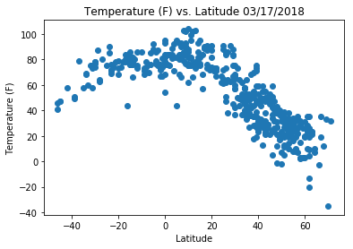
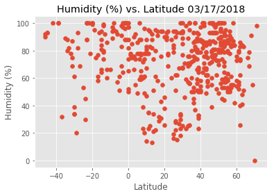
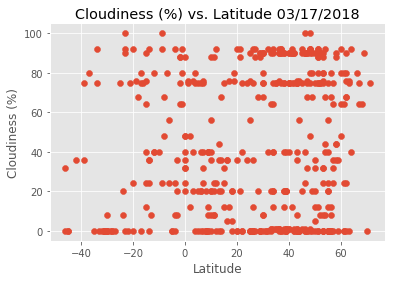
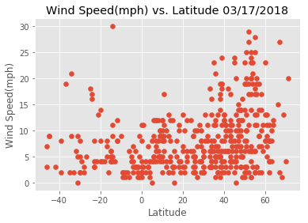

```python
!pip install citipy
```

    Requirement already satisfied: citipy in c:\users\faisal\anaconda3\envs\pydata\lib\site-packages
    Requirement already satisfied: kdtree>=0.12 in c:\users\faisal\anaconda3\envs\pydata\lib\site-packages (from citipy)
    


```python
import matplotlib.pyplot as plt
from citipy import citipy as cp
import pandas as pd
```


```python
#Grab list of cities based on coordinates from citipy
citylist = []
count = 0
dup = 'no'

for x in range(-90,90,1):
    for y in range(-180,180,1):
        city = cp.nearest_city(x, y)
        citdict = {}
        citdict['city'] = city.city_name
        citdict['country'] = city.country_code
        citdict['lat'] = x
        citdict['long'] = y
        if len(citylist) == 0:
            citylist.append(citdict)
            count+=1
            continue
        else:
            #Get rid of duplicates
            for city in citylist:
                if city['city'] == citdict['city']:
                    dup = 'yes'
        if dup == 'no':
            citylist.append(citdict)
            count+=1
        else:
            dup = 'no'

print(len(citylist))
```

    7957
    


```python
print(citylist[0])
```

    {'city': 'vaini', 'country': 'to', 'lat': -90, 'long': -180}
    


```python
import requests as req
import json
```


```python
#Create dataframe. Grab 500 random cities
citypd = pd.DataFrame({
    'city': [x['city'] for x in citylist],
    'country': [x['country'] for x in citylist],
})

citypd.head()

samplecity = citypd.sample(500)
```


```python
samplecity
```


<div>
<style>
    .dataframe thead tr:only-child th {
        text-align: right;
    }

    .dataframe thead th {
        text-align: left;
    }

    .dataframe tbody tr th {
        vertical-align: top;
    }
</style>
<table border="1" class="dataframe">
  <thead>
    <tr style="text-align: right;">
      <th></th>
      <th>city</th>
      <th>country</th>
    </tr>
  </thead>
  <tbody>
    <tr>
      <th>2246</th>
      <td>bechem</td>
      <td>gh</td>
    </tr>
    <tr>
      <th>6559</th>
      <td>de-kastri</td>
      <td>ru</td>
    </tr>
    <tr>
      <th>5186</th>
      <td>helong</td>
      <td>cn</td>
    </tr>
    <tr>
      <th>7376</th>
      <td>tobolsk</td>
      <td>ru</td>
    </tr>
    <tr>
      <th>1943</th>
      <td>marsabit</td>
      <td>ke</td>
    </tr>
    <tr>
      <th>2497</th>
      <td>tokonou</td>
      <td>gn</td>
    </tr>
    <tr>
      <th>1780</th>
      <td>braganca</td>
      <td>br</td>
    </tr>
    <tr>
      <th>5921</th>
      <td>manzhouli</td>
      <td>cn</td>
    </tr>
    <tr>
      <th>1614</th>
      <td>mangai</td>
      <td>cd</td>
    </tr>
    <tr>
      <th>384</th>
      <td>casino</td>
      <td>au</td>
    </tr>
    <tr>
      <th>4646</th>
      <td>syracuse</td>
      <td>it</td>
    </tr>
    <tr>
      <th>5076</th>
      <td>winnemucca</td>
      <td>us</td>
    </tr>
    <tr>
      <th>7632</th>
      <td>kholodnyy</td>
      <td>ru</td>
    </tr>
    <tr>
      <th>6861</th>
      <td>bailieborough</td>
      <td>ie</td>
    </tr>
    <tr>
      <th>1112</th>
      <td>longonjo</td>
      <td>ao</td>
    </tr>
    <tr>
      <th>4495</th>
      <td>canyon</td>
      <td>us</td>
    </tr>
    <tr>
      <th>3181</th>
      <td>den chai</td>
      <td>th</td>
    </tr>
    <tr>
      <th>7342</th>
      <td>volot</td>
      <td>ru</td>
    </tr>
    <tr>
      <th>7052</th>
      <td>kormilovka</td>
      <td>ru</td>
    </tr>
    <tr>
      <th>6888</th>
      <td>suwalki</td>
      <td>pl</td>
    </tr>
    <tr>
      <th>4473</th>
      <td>waki</td>
      <td>jp</td>
    </tr>
    <tr>
      <th>4688</th>
      <td>kuche</td>
      <td>cn</td>
    </tr>
    <tr>
      <th>5288</th>
      <td>akdepe</td>
      <td>tm</td>
    </tr>
    <tr>
      <th>7479</th>
      <td>yuzhno-yeniseyskiy</td>
      <td>ru</td>
    </tr>
    <tr>
      <th>6155</th>
      <td>gannan</td>
      <td>cn</td>
    </tr>
    <tr>
      <th>326</th>
      <td>kempsey</td>
      <td>au</td>
    </tr>
    <tr>
      <th>7203</th>
      <td>juneau</td>
      <td>us</td>
    </tr>
    <tr>
      <th>3543</th>
      <td>ahuimanu</td>
      <td>us</td>
    </tr>
    <tr>
      <th>4838</th>
      <td>concord</td>
      <td>us</td>
    </tr>
    <tr>
      <th>4023</th>
      <td>benjamin hill</td>
      <td>mx</td>
    </tr>
    <tr>
      <th>...</th>
      <td>...</td>
      <td>...</td>
    </tr>
    <tr>
      <th>6448</th>
      <td>neepawa</td>
      <td>ca</td>
    </tr>
    <tr>
      <th>3783</th>
      <td>valle de allende</td>
      <td>mx</td>
    </tr>
    <tr>
      <th>6725</th>
      <td>kilrush</td>
      <td>ie</td>
    </tr>
    <tr>
      <th>3207</th>
      <td>frontera</td>
      <td>mx</td>
    </tr>
    <tr>
      <th>7138</th>
      <td>zvenigovo</td>
      <td>ru</td>
    </tr>
    <tr>
      <th>647</th>
      <td>chipinge</td>
      <td>zw</td>
    </tr>
    <tr>
      <th>6740</th>
      <td>heerenveen</td>
      <td>nl</td>
    </tr>
    <tr>
      <th>2949</th>
      <td>keita</td>
      <td>ne</td>
    </tr>
    <tr>
      <th>3686</th>
      <td>longyan</td>
      <td>cn</td>
    </tr>
    <tr>
      <th>4786</th>
      <td>idil</td>
      <td>tr</td>
    </tr>
    <tr>
      <th>6410</th>
      <td>bichura</td>
      <td>ru</td>
    </tr>
    <tr>
      <th>1382</th>
      <td>wau</td>
      <td>pg</td>
    </tr>
    <tr>
      <th>2199</th>
      <td>moratuwa</td>
      <td>lk</td>
    </tr>
    <tr>
      <th>2471</th>
      <td>limon</td>
      <td>cr</td>
    </tr>
    <tr>
      <th>5798</th>
      <td>hailin</td>
      <td>cn</td>
    </tr>
    <tr>
      <th>3688</th>
      <td>luoyang</td>
      <td>cn</td>
    </tr>
    <tr>
      <th>6159</th>
      <td>cuiluan</td>
      <td>cn</td>
    </tr>
    <tr>
      <th>5294</th>
      <td>paytug</td>
      <td>uz</td>
    </tr>
    <tr>
      <th>3780</th>
      <td>etchojoa</td>
      <td>mx</td>
    </tr>
    <tr>
      <th>4529</th>
      <td>dingli</td>
      <td>mt</td>
    </tr>
    <tr>
      <th>4715</th>
      <td>sunrise manor</td>
      <td>us</td>
    </tr>
    <tr>
      <th>3066</th>
      <td>lompoc</td>
      <td>us</td>
    </tr>
    <tr>
      <th>2491</th>
      <td>rio claro</td>
      <td>tt</td>
    </tr>
    <tr>
      <th>1981</th>
      <td>yokadouma</td>
      <td>cm</td>
    </tr>
    <tr>
      <th>2486</th>
      <td>cua</td>
      <td>ve</td>
    </tr>
    <tr>
      <th>1963</th>
      <td>burica</td>
      <td>pa</td>
    </tr>
    <tr>
      <th>4510</th>
      <td>gainesville</td>
      <td>us</td>
    </tr>
    <tr>
      <th>390</th>
      <td>cerrito</td>
      <td>py</td>
    </tr>
    <tr>
      <th>7535</th>
      <td>podosinovets</td>
      <td>ru</td>
    </tr>
    <tr>
      <th>812</th>
      <td>saint-denis</td>
      <td>re</td>
    </tr>
  </tbody>
</table>
<p>500 rows × 2 columns</p>
</div>


```python
apikey = '9e861b2a772ee55acbe86461ecea57cf'
url = "http://api.openweathermap.org/data/2.5/weather?"
units = "Imperial"
count = 0
samplecity['latitude'] = ""
samplecity['longitude'] = ""
samplecity['temperature'] = ""
samplecity['humidity'] = ""
samplecity['cloudiness'] = ""
samplecity['wind_speed'] = ""

for index,row in samplecity.iterrows():
    count+= 1
    query_url = url + "appid=" + apikey + "&units=" + units + "&q=" + row['city']
    try:
        weather_response = req.get(query_url)
        cityweather = weather_response.json()
#         print(cityweather)
        samplecity.set_value(index, "latitude", int(cityweather['coord']['lat']))
        samplecity.set_value(index, "longitude", int(cityweather['coord']['lat']))
        samplecity.set_value(index, "temperature", int(cityweather['main']['temp']))
        samplecity.set_value(index, "humidity", int(cityweather['main']['humidity']))
        samplecity.set_value(index, "cloudiness", int(cityweather['clouds']['all']))
        samplecity.set_value(index, "wind_speed", int(cityweather['wind']['speed']))
    except:
        print(f"No data for this city: {row['city']}")
    print(f"This is city#: {count}")
    print(f"This is: {row['city']}" )
    print(f"This is the requested URL: {query_url}")

```

    This is city#: 1
    This is: bechem
    This is the requested URL: http://api.openweathermap.org/data/2.5/weather?appid=9e861b2a772ee55acbe86461ecea57cf&units=Imperial&q=bechem
    This is city#: 2
    This is: de-kastri
    This is the requested URL: http://api.openweathermap.org/data/2.5/weather?appid=9e861b2a772ee55acbe86461ecea57cf&units=Imperial&q=de-kastri
    This is city#: 3
    This is: helong
    This is the requested URL: http://api.openweathermap.org/data/2.5/weather?appid=9e861b2a772ee55acbe86461ecea57cf&units=Imperial&q=helong
    This is city#: 4
    This is: tobolsk
    This is the requested URL: http://api.openweathermap.org/data/2.5/weather?appid=9e861b2a772ee55acbe86461ecea57cf&units=Imperial&q=tobolsk
    This is city#: 5
    This is: marsabit
    This is the requested URL: http://api.openweathermap.org/data/2.5/weather?appid=9e861b2a772ee55acbe86461ecea57cf&units=Imperial&q=marsabit
    This is city#: 6
    This is: tokonou
    This is the requested URL: http://api.openweathermap.org/data/2.5/weather?appid=9e861b2a772ee55acbe86461ecea57cf&units=Imperial&q=tokonou
    This is city#: 7
    This is: braganca
    This is the requested URL: http://api.openweathermap.org/data/2.5/weather?appid=9e861b2a772ee55acbe86461ecea57cf&units=Imperial&q=braganca
    This is city#: 8
    This is: manzhouli
    This is the requested URL: http://api.openweathermap.org/data/2.5/weather?appid=9e861b2a772ee55acbe86461ecea57cf&units=Imperial&q=manzhouli
    This is city#: 9
    This is: mangai
    This is the requested URL: http://api.openweathermap.org/data/2.5/weather?appid=9e861b2a772ee55acbe86461ecea57cf&units=Imperial&q=mangai
    This is city#: 10
    This is: casino
    This is the requested URL: http://api.openweathermap.org/data/2.5/weather?appid=9e861b2a772ee55acbe86461ecea57cf&units=Imperial&q=casino
    This is city#: 11
    This is: syracuse
    This is the requested URL: http://api.openweathermap.org/data/2.5/weather?appid=9e861b2a772ee55acbe86461ecea57cf&units=Imperial&q=syracuse
    This is city#: 12
    This is: winnemucca
    This is the requested URL: http://api.openweathermap.org/data/2.5/weather?appid=9e861b2a772ee55acbe86461ecea57cf&units=Imperial&q=winnemucca
    This is city#: 13
    This is: kholodnyy
    This is the requested URL: http://api.openweathermap.org/data/2.5/weather?appid=9e861b2a772ee55acbe86461ecea57cf&units=Imperial&q=kholodnyy
    This is city#: 14
    This is: bailieborough
    This is the requested URL: http://api.openweathermap.org/data/2.5/weather?appid=9e861b2a772ee55acbe86461ecea57cf&units=Imperial&q=bailieborough
    This is city#: 15
    This is: longonjo
    This is the requested URL: http://api.openweathermap.org/data/2.5/weather?appid=9e861b2a772ee55acbe86461ecea57cf&units=Imperial&q=longonjo
    This is city#: 16
    This is: canyon
    This is the requested URL: http://api.openweathermap.org/data/2.5/weather?appid=9e861b2a772ee55acbe86461ecea57cf&units=Imperial&q=canyon
    This is city#: 17
    This is: den chai
    This is the requested URL: http://api.openweathermap.org/data/2.5/weather?appid=9e861b2a772ee55acbe86461ecea57cf&units=Imperial&q=den chai
    This is city#: 18
    This is: volot
    This is the requested URL: http://api.openweathermap.org/data/2.5/weather?appid=9e861b2a772ee55acbe86461ecea57cf&units=Imperial&q=volot
    This is city#: 19
    This is: kormilovka
    This is the requested URL: http://api.openweathermap.org/data/2.5/weather?appid=9e861b2a772ee55acbe86461ecea57cf&units=Imperial&q=kormilovka
    This is city#: 20
    This is: suwalki
    This is the requested URL: http://api.openweathermap.org/data/2.5/weather?appid=9e861b2a772ee55acbe86461ecea57cf&units=Imperial&q=suwalki
    This is city#: 21
    This is: waki
    This is the requested URL: http://api.openweathermap.org/data/2.5/weather?appid=9e861b2a772ee55acbe86461ecea57cf&units=Imperial&q=waki
    No data for this city: kuche
    This is city#: 22
    This is: kuche
    This is the requested URL: http://api.openweathermap.org/data/2.5/weather?appid=9e861b2a772ee55acbe86461ecea57cf&units=Imperial&q=kuche
    This is city#: 23
    This is: akdepe
    This is the requested URL: http://api.openweathermap.org/data/2.5/weather?appid=9e861b2a772ee55acbe86461ecea57cf&units=Imperial&q=akdepe
    No data for this city: yuzhno-yeniseyskiy
    This is city#: 24
    This is: yuzhno-yeniseyskiy
    This is the requested URL: http://api.openweathermap.org/data/2.5/weather?appid=9e861b2a772ee55acbe86461ecea57cf&units=Imperial&q=yuzhno-yeniseyskiy
    This is city#: 25
    This is: gannan
    This is the requested URL: http://api.openweathermap.org/data/2.5/weather?appid=9e861b2a772ee55acbe86461ecea57cf&units=Imperial&q=gannan
    This is city#: 26
    This is: kempsey
    This is the requested URL: http://api.openweathermap.org/data/2.5/weather?appid=9e861b2a772ee55acbe86461ecea57cf&units=Imperial&q=kempsey
    This is city#: 27
    This is: juneau
    This is the requested URL: http://api.openweathermap.org/data/2.5/weather?appid=9e861b2a772ee55acbe86461ecea57cf&units=Imperial&q=juneau
    This is city#: 28
    This is: ahuimanu
    This is the requested URL: http://api.openweathermap.org/data/2.5/weather?appid=9e861b2a772ee55acbe86461ecea57cf&units=Imperial&q=ahuimanu
    This is city#: 29
    This is: concord
    This is the requested URL: http://api.openweathermap.org/data/2.5/weather?appid=9e861b2a772ee55acbe86461ecea57cf&units=Imperial&q=concord
    This is city#: 30
    This is: benjamin hill
    This is the requested URL: http://api.openweathermap.org/data/2.5/weather?appid=9e861b2a772ee55acbe86461ecea57cf&units=Imperial&q=benjamin hill
    This is city#: 31
    This is: cascais
    This is the requested URL: http://api.openweathermap.org/data/2.5/weather?appid=9e861b2a772ee55acbe86461ecea57cf&units=Imperial&q=cascais
    This is city#: 32
    This is: idrija
    This is the requested URL: http://api.openweathermap.org/data/2.5/weather?appid=9e861b2a772ee55acbe86461ecea57cf&units=Imperial&q=idrija
    This is city#: 33
    This is: adet
    This is the requested URL: http://api.openweathermap.org/data/2.5/weather?appid=9e861b2a772ee55acbe86461ecea57cf&units=Imperial&q=adet
    No data for this city: lugovskiy
    This is city#: 34
    This is: lugovskiy
    This is the requested URL: http://api.openweathermap.org/data/2.5/weather?appid=9e861b2a772ee55acbe86461ecea57cf&units=Imperial&q=lugovskiy
    This is city#: 35
    This is: corrales
    This is the requested URL: http://api.openweathermap.org/data/2.5/weather?appid=9e861b2a772ee55acbe86461ecea57cf&units=Imperial&q=corrales
    This is city#: 36
    This is: topolobampo
    This is the requested URL: http://api.openweathermap.org/data/2.5/weather?appid=9e861b2a772ee55acbe86461ecea57cf&units=Imperial&q=topolobampo
    This is city#: 37
    This is: coari
    This is the requested URL: http://api.openweathermap.org/data/2.5/weather?appid=9e861b2a772ee55acbe86461ecea57cf&units=Imperial&q=coari
    No data for this city: skagastrond
    This is city#: 38
    This is: skagastrond
    This is the requested URL: http://api.openweathermap.org/data/2.5/weather?appid=9e861b2a772ee55acbe86461ecea57cf&units=Imperial&q=skagastrond
    This is city#: 39
    This is: pirna
    This is the requested URL: http://api.openweathermap.org/data/2.5/weather?appid=9e861b2a772ee55acbe86461ecea57cf&units=Imperial&q=pirna
    This is city#: 40
    This is: herrin
    This is the requested URL: http://api.openweathermap.org/data/2.5/weather?appid=9e861b2a772ee55acbe86461ecea57cf&units=Imperial&q=herrin
    This is city#: 41
    This is: esil
    This is the requested URL: http://api.openweathermap.org/data/2.5/weather?appid=9e861b2a772ee55acbe86461ecea57cf&units=Imperial&q=esil
    This is city#: 42
    This is: sultanpur
    This is the requested URL: http://api.openweathermap.org/data/2.5/weather?appid=9e861b2a772ee55acbe86461ecea57cf&units=Imperial&q=sultanpur
    No data for this city: leshan
    This is city#: 43
    This is: leshan
    This is the requested URL: http://api.openweathermap.org/data/2.5/weather?appid=9e861b2a772ee55acbe86461ecea57cf&units=Imperial&q=leshan
    This is city#: 44
    This is: bhadra
    This is the requested URL: http://api.openweathermap.org/data/2.5/weather?appid=9e861b2a772ee55acbe86461ecea57cf&units=Imperial&q=bhadra
    This is city#: 45
    This is: takayama
    This is the requested URL: http://api.openweathermap.org/data/2.5/weather?appid=9e861b2a772ee55acbe86461ecea57cf&units=Imperial&q=takayama
    This is city#: 46
    This is: owensboro
    This is the requested URL: http://api.openweathermap.org/data/2.5/weather?appid=9e861b2a772ee55acbe86461ecea57cf&units=Imperial&q=owensboro
    This is city#: 47
    This is: mwandiga
    This is the requested URL: http://api.openweathermap.org/data/2.5/weather?appid=9e861b2a772ee55acbe86461ecea57cf&units=Imperial&q=mwandiga
    This is city#: 48
    This is: garissa
    This is the requested URL: http://api.openweathermap.org/data/2.5/weather?appid=9e861b2a772ee55acbe86461ecea57cf&units=Imperial&q=garissa
    This is city#: 49
    This is: uglegorsk
    This is the requested URL: http://api.openweathermap.org/data/2.5/weather?appid=9e861b2a772ee55acbe86461ecea57cf&units=Imperial&q=uglegorsk
    This is city#: 50
    This is: goianesia
    This is the requested URL: http://api.openweathermap.org/data/2.5/weather?appid=9e861b2a772ee55acbe86461ecea57cf&units=Imperial&q=goianesia
    No data for this city: pinotepa nacional
    This is city#: 51
    This is: pinotepa nacional
    This is the requested URL: http://api.openweathermap.org/data/2.5/weather?appid=9e861b2a772ee55acbe86461ecea57cf&units=Imperial&q=pinotepa nacional
    This is city#: 52
    This is: dengzhou
    This is the requested URL: http://api.openweathermap.org/data/2.5/weather?appid=9e861b2a772ee55acbe86461ecea57cf&units=Imperial&q=dengzhou
    This is city#: 53
    This is: tshane
    This is the requested URL: http://api.openweathermap.org/data/2.5/weather?appid=9e861b2a772ee55acbe86461ecea57cf&units=Imperial&q=tshane
    This is city#: 54
    This is: monclova
    This is the requested URL: http://api.openweathermap.org/data/2.5/weather?appid=9e861b2a772ee55acbe86461ecea57cf&units=Imperial&q=monclova
    This is city#: 55
    This is: posse
    This is the requested URL: http://api.openweathermap.org/data/2.5/weather?appid=9e861b2a772ee55acbe86461ecea57cf&units=Imperial&q=posse
    This is city#: 56
    This is: milledgeville
    This is the requested URL: http://api.openweathermap.org/data/2.5/weather?appid=9e861b2a772ee55acbe86461ecea57cf&units=Imperial&q=milledgeville
    This is city#: 57
    This is: lysva
    This is the requested URL: http://api.openweathermap.org/data/2.5/weather?appid=9e861b2a772ee55acbe86461ecea57cf&units=Imperial&q=lysva
    This is city#: 58
    This is: puro
    This is the requested URL: http://api.openweathermap.org/data/2.5/weather?appid=9e861b2a772ee55acbe86461ecea57cf&units=Imperial&q=puro
    This is city#: 59
    This is: kisiwani
    This is the requested URL: http://api.openweathermap.org/data/2.5/weather?appid=9e861b2a772ee55acbe86461ecea57cf&units=Imperial&q=kisiwani
    No data for this city: ahrarne
    This is city#: 60
    This is: ahrarne
    This is the requested URL: http://api.openweathermap.org/data/2.5/weather?appid=9e861b2a772ee55acbe86461ecea57cf&units=Imperial&q=ahrarne
    This is city#: 61
    This is: severodvinsk
    This is the requested URL: http://api.openweathermap.org/data/2.5/weather?appid=9e861b2a772ee55acbe86461ecea57cf&units=Imperial&q=severodvinsk
    This is city#: 62
    This is: ivanovo
    This is the requested URL: http://api.openweathermap.org/data/2.5/weather?appid=9e861b2a772ee55acbe86461ecea57cf&units=Imperial&q=ivanovo
    This is city#: 63
    This is: kalaiya
    This is the requested URL: http://api.openweathermap.org/data/2.5/weather?appid=9e861b2a772ee55acbe86461ecea57cf&units=Imperial&q=kalaiya
    This is city#: 64
    This is: monchegorsk
    This is the requested URL: http://api.openweathermap.org/data/2.5/weather?appid=9e861b2a772ee55acbe86461ecea57cf&units=Imperial&q=monchegorsk
    No data for this city: falealupo
    This is city#: 65
    This is: falealupo
    This is the requested URL: http://api.openweathermap.org/data/2.5/weather?appid=9e861b2a772ee55acbe86461ecea57cf&units=Imperial&q=falealupo
    This is city#: 66
    This is: yashan
    This is the requested URL: http://api.openweathermap.org/data/2.5/weather?appid=9e861b2a772ee55acbe86461ecea57cf&units=Imperial&q=yashan
    This is city#: 67
    This is: avare
    This is the requested URL: http://api.openweathermap.org/data/2.5/weather?appid=9e861b2a772ee55acbe86461ecea57cf&units=Imperial&q=avare
    This is city#: 68
    This is: novoorsk
    This is the requested URL: http://api.openweathermap.org/data/2.5/weather?appid=9e861b2a772ee55acbe86461ecea57cf&units=Imperial&q=novoorsk
    This is city#: 69
    This is: nogliki
    This is the requested URL: http://api.openweathermap.org/data/2.5/weather?appid=9e861b2a772ee55acbe86461ecea57cf&units=Imperial&q=nogliki
    No data for this city: tres lagoas
    This is city#: 70
    This is: tres lagoas
    This is the requested URL: http://api.openweathermap.org/data/2.5/weather?appid=9e861b2a772ee55acbe86461ecea57cf&units=Imperial&q=tres lagoas
    This is city#: 71
    This is: barkhan
    This is the requested URL: http://api.openweathermap.org/data/2.5/weather?appid=9e861b2a772ee55acbe86461ecea57cf&units=Imperial&q=barkhan
    This is city#: 72
    This is: vila praia de ancora
    This is the requested URL: http://api.openweathermap.org/data/2.5/weather?appid=9e861b2a772ee55acbe86461ecea57cf&units=Imperial&q=vila praia de ancora
    This is city#: 73
    This is: danane
    This is the requested URL: http://api.openweathermap.org/data/2.5/weather?appid=9e861b2a772ee55acbe86461ecea57cf&units=Imperial&q=danane
    No data for this city: yakshur-bodya
    This is city#: 74
    This is: yakshur-bodya
    This is the requested URL: http://api.openweathermap.org/data/2.5/weather?appid=9e861b2a772ee55acbe86461ecea57cf&units=Imperial&q=yakshur-bodya
    This is city#: 75
    This is: uglovskoye
    This is the requested URL: http://api.openweathermap.org/data/2.5/weather?appid=9e861b2a772ee55acbe86461ecea57cf&units=Imperial&q=uglovskoye
    This is city#: 76
    This is: were ilu
    This is the requested URL: http://api.openweathermap.org/data/2.5/weather?appid=9e861b2a772ee55acbe86461ecea57cf&units=Imperial&q=were ilu
    This is city#: 77
    This is: tulun
    This is the requested URL: http://api.openweathermap.org/data/2.5/weather?appid=9e861b2a772ee55acbe86461ecea57cf&units=Imperial&q=tulun
    This is city#: 78
    This is: palmerston
    This is the requested URL: http://api.openweathermap.org/data/2.5/weather?appid=9e861b2a772ee55acbe86461ecea57cf&units=Imperial&q=palmerston
    This is city#: 79
    This is: xining
    This is the requested URL: http://api.openweathermap.org/data/2.5/weather?appid=9e861b2a772ee55acbe86461ecea57cf&units=Imperial&q=xining
    This is city#: 80
    This is: port victoria
    This is the requested URL: http://api.openweathermap.org/data/2.5/weather?appid=9e861b2a772ee55acbe86461ecea57cf&units=Imperial&q=port victoria
    This is city#: 81
    This is: kaitong
    This is the requested URL: http://api.openweathermap.org/data/2.5/weather?appid=9e861b2a772ee55acbe86461ecea57cf&units=Imperial&q=kaitong
    This is city#: 82
    This is: amalapuram
    This is the requested URL: http://api.openweathermap.org/data/2.5/weather?appid=9e861b2a772ee55acbe86461ecea57cf&units=Imperial&q=amalapuram
    This is city#: 83
    This is: kakonko
    This is the requested URL: http://api.openweathermap.org/data/2.5/weather?appid=9e861b2a772ee55acbe86461ecea57cf&units=Imperial&q=kakonko
    No data for this city: cheuskiny
    This is city#: 84
    This is: cheuskiny
    This is the requested URL: http://api.openweathermap.org/data/2.5/weather?appid=9e861b2a772ee55acbe86461ecea57cf&units=Imperial&q=cheuskiny
    This is city#: 85
    This is: seymour
    This is the requested URL: http://api.openweathermap.org/data/2.5/weather?appid=9e861b2a772ee55acbe86461ecea57cf&units=Imperial&q=seymour
    This is city#: 86
    This is: karatau
    This is the requested URL: http://api.openweathermap.org/data/2.5/weather?appid=9e861b2a772ee55acbe86461ecea57cf&units=Imperial&q=karatau
    No data for this city: scottsburgh
    This is city#: 87
    This is: scottsburgh
    This is the requested URL: http://api.openweathermap.org/data/2.5/weather?appid=9e861b2a772ee55acbe86461ecea57cf&units=Imperial&q=scottsburgh
    This is city#: 88
    This is: valdivia
    This is the requested URL: http://api.openweathermap.org/data/2.5/weather?appid=9e861b2a772ee55acbe86461ecea57cf&units=Imperial&q=valdivia
    This is city#: 89
    This is: stawell
    This is the requested URL: http://api.openweathermap.org/data/2.5/weather?appid=9e861b2a772ee55acbe86461ecea57cf&units=Imperial&q=stawell
    No data for this city: viligili
    This is city#: 90
    This is: viligili
    This is the requested URL: http://api.openweathermap.org/data/2.5/weather?appid=9e861b2a772ee55acbe86461ecea57cf&units=Imperial&q=viligili
    This is city#: 91
    This is: ito
    This is the requested URL: http://api.openweathermap.org/data/2.5/weather?appid=9e861b2a772ee55acbe86461ecea57cf&units=Imperial&q=ito
    This is city#: 92
    This is: wajima
    This is the requested URL: http://api.openweathermap.org/data/2.5/weather?appid=9e861b2a772ee55acbe86461ecea57cf&units=Imperial&q=wajima
    This is city#: 93
    This is: paka
    This is the requested URL: http://api.openweathermap.org/data/2.5/weather?appid=9e861b2a772ee55acbe86461ecea57cf&units=Imperial&q=paka
    This is city#: 94
    This is: pteleos
    This is the requested URL: http://api.openweathermap.org/data/2.5/weather?appid=9e861b2a772ee55acbe86461ecea57cf&units=Imperial&q=pteleos
    This is city#: 95
    This is: matam
    This is the requested URL: http://api.openweathermap.org/data/2.5/weather?appid=9e861b2a772ee55acbe86461ecea57cf&units=Imperial&q=matam
    No data for this city: abu jubayhah
    This is city#: 96
    This is: abu jubayhah
    This is the requested URL: http://api.openweathermap.org/data/2.5/weather?appid=9e861b2a772ee55acbe86461ecea57cf&units=Imperial&q=abu jubayhah
    This is city#: 97
    This is: pala
    This is the requested URL: http://api.openweathermap.org/data/2.5/weather?appid=9e861b2a772ee55acbe86461ecea57cf&units=Imperial&q=pala
    This is city#: 98
    This is: voyvozh
    This is the requested URL: http://api.openweathermap.org/data/2.5/weather?appid=9e861b2a772ee55acbe86461ecea57cf&units=Imperial&q=voyvozh
    This is city#: 99
    This is: krasnovka
    This is the requested URL: http://api.openweathermap.org/data/2.5/weather?appid=9e861b2a772ee55acbe86461ecea57cf&units=Imperial&q=krasnovka
    This is city#: 100
    This is: erie
    This is the requested URL: http://api.openweathermap.org/data/2.5/weather?appid=9e861b2a772ee55acbe86461ecea57cf&units=Imperial&q=erie
    This is city#: 101
    This is: robe
    This is the requested URL: http://api.openweathermap.org/data/2.5/weather?appid=9e861b2a772ee55acbe86461ecea57cf&units=Imperial&q=robe
    This is city#: 102
    This is: souillac
    This is the requested URL: http://api.openweathermap.org/data/2.5/weather?appid=9e861b2a772ee55acbe86461ecea57cf&units=Imperial&q=souillac
    No data for this city: yialos
    This is city#: 103
    This is: yialos
    This is the requested URL: http://api.openweathermap.org/data/2.5/weather?appid=9e861b2a772ee55acbe86461ecea57cf&units=Imperial&q=yialos
    This is city#: 104
    This is: pyshma
    This is the requested URL: http://api.openweathermap.org/data/2.5/weather?appid=9e861b2a772ee55acbe86461ecea57cf&units=Imperial&q=pyshma
    This is city#: 105
    This is: kefamenanu
    This is the requested URL: http://api.openweathermap.org/data/2.5/weather?appid=9e861b2a772ee55acbe86461ecea57cf&units=Imperial&q=kefamenanu
    This is city#: 106
    This is: kremenki
    This is the requested URL: http://api.openweathermap.org/data/2.5/weather?appid=9e861b2a772ee55acbe86461ecea57cf&units=Imperial&q=kremenki
    This is city#: 107
    This is: kingussie
    This is the requested URL: http://api.openweathermap.org/data/2.5/weather?appid=9e861b2a772ee55acbe86461ecea57cf&units=Imperial&q=kingussie
    This is city#: 108
    This is: kulevcha
    This is the requested URL: http://api.openweathermap.org/data/2.5/weather?appid=9e861b2a772ee55acbe86461ecea57cf&units=Imperial&q=kulevcha
    This is city#: 109
    This is: mugur-aksy
    This is the requested URL: http://api.openweathermap.org/data/2.5/weather?appid=9e861b2a772ee55acbe86461ecea57cf&units=Imperial&q=mugur-aksy
    This is city#: 110
    This is: gunnedah
    This is the requested URL: http://api.openweathermap.org/data/2.5/weather?appid=9e861b2a772ee55acbe86461ecea57cf&units=Imperial&q=gunnedah
    This is city#: 111
    This is: binzhou
    This is the requested URL: http://api.openweathermap.org/data/2.5/weather?appid=9e861b2a772ee55acbe86461ecea57cf&units=Imperial&q=binzhou
    This is city#: 112
    This is: san jose de buan
    This is the requested URL: http://api.openweathermap.org/data/2.5/weather?appid=9e861b2a772ee55acbe86461ecea57cf&units=Imperial&q=san jose de buan
    No data for this city: barroualie
    This is city#: 113
    This is: barroualie
    This is the requested URL: http://api.openweathermap.org/data/2.5/weather?appid=9e861b2a772ee55acbe86461ecea57cf&units=Imperial&q=barroualie
    This is city#: 114
    This is: barabai
    This is the requested URL: http://api.openweathermap.org/data/2.5/weather?appid=9e861b2a772ee55acbe86461ecea57cf&units=Imperial&q=barabai
    This is city#: 115
    This is: tawang
    This is the requested URL: http://api.openweathermap.org/data/2.5/weather?appid=9e861b2a772ee55acbe86461ecea57cf&units=Imperial&q=tawang
    This is city#: 116
    This is: rach gia
    This is the requested URL: http://api.openweathermap.org/data/2.5/weather?appid=9e861b2a772ee55acbe86461ecea57cf&units=Imperial&q=rach gia
    This is city#: 117
    This is: turangi
    This is the requested URL: http://api.openweathermap.org/data/2.5/weather?appid=9e861b2a772ee55acbe86461ecea57cf&units=Imperial&q=turangi
    This is city#: 118
    This is: shush
    This is the requested URL: http://api.openweathermap.org/data/2.5/weather?appid=9e861b2a772ee55acbe86461ecea57cf&units=Imperial&q=shush
    This is city#: 119
    This is: marshalltown
    This is the requested URL: http://api.openweathermap.org/data/2.5/weather?appid=9e861b2a772ee55acbe86461ecea57cf&units=Imperial&q=marshalltown
    No data for this city: jhikargachha
    This is city#: 120
    This is: jhikargachha
    This is the requested URL: http://api.openweathermap.org/data/2.5/weather?appid=9e861b2a772ee55acbe86461ecea57cf&units=Imperial&q=jhikargachha
    This is city#: 121
    This is: rumoi
    This is the requested URL: http://api.openweathermap.org/data/2.5/weather?appid=9e861b2a772ee55acbe86461ecea57cf&units=Imperial&q=rumoi
    This is city#: 122
    This is: pahrump
    This is the requested URL: http://api.openweathermap.org/data/2.5/weather?appid=9e861b2a772ee55acbe86461ecea57cf&units=Imperial&q=pahrump
    This is city#: 123
    This is: zermatt
    This is the requested URL: http://api.openweathermap.org/data/2.5/weather?appid=9e861b2a772ee55acbe86461ecea57cf&units=Imperial&q=zermatt
    This is city#: 124
    This is: aracaju
    This is the requested URL: http://api.openweathermap.org/data/2.5/weather?appid=9e861b2a772ee55acbe86461ecea57cf&units=Imperial&q=aracaju
    No data for this city: imisli
    This is city#: 125
    This is: imisli
    This is the requested URL: http://api.openweathermap.org/data/2.5/weather?appid=9e861b2a772ee55acbe86461ecea57cf&units=Imperial&q=imisli
    This is city#: 126
    This is: bhainsa
    This is the requested URL: http://api.openweathermap.org/data/2.5/weather?appid=9e861b2a772ee55acbe86461ecea57cf&units=Imperial&q=bhainsa
    No data for this city: sedelnikovo
    This is city#: 127
    This is: sedelnikovo
    This is the requested URL: http://api.openweathermap.org/data/2.5/weather?appid=9e861b2a772ee55acbe86461ecea57cf&units=Imperial&q=sedelnikovo
    This is city#: 128
    This is: scottsbluff
    This is the requested URL: http://api.openweathermap.org/data/2.5/weather?appid=9e861b2a772ee55acbe86461ecea57cf&units=Imperial&q=scottsbluff
    This is city#: 129
    This is: tilichiki
    This is the requested URL: http://api.openweathermap.org/data/2.5/weather?appid=9e861b2a772ee55acbe86461ecea57cf&units=Imperial&q=tilichiki
    This is city#: 130
    This is: ariquemes
    This is the requested URL: http://api.openweathermap.org/data/2.5/weather?appid=9e861b2a772ee55acbe86461ecea57cf&units=Imperial&q=ariquemes
    This is city#: 131
    This is: san ramon de la nueva oran
    This is the requested URL: http://api.openweathermap.org/data/2.5/weather?appid=9e861b2a772ee55acbe86461ecea57cf&units=Imperial&q=san ramon de la nueva oran
    This is city#: 132
    This is: rudnaya pristan
    This is the requested URL: http://api.openweathermap.org/data/2.5/weather?appid=9e861b2a772ee55acbe86461ecea57cf&units=Imperial&q=rudnaya pristan
    This is city#: 133
    This is: saint-raymond
    This is the requested URL: http://api.openweathermap.org/data/2.5/weather?appid=9e861b2a772ee55acbe86461ecea57cf&units=Imperial&q=saint-raymond
    This is city#: 134
    This is: divnogorsk
    This is the requested URL: http://api.openweathermap.org/data/2.5/weather?appid=9e861b2a772ee55acbe86461ecea57cf&units=Imperial&q=divnogorsk
    This is city#: 135
    This is: lumphat
    This is the requested URL: http://api.openweathermap.org/data/2.5/weather?appid=9e861b2a772ee55acbe86461ecea57cf&units=Imperial&q=lumphat
    This is city#: 136
    This is: ciudad bolivar
    This is the requested URL: http://api.openweathermap.org/data/2.5/weather?appid=9e861b2a772ee55acbe86461ecea57cf&units=Imperial&q=ciudad bolivar
    This is city#: 137
    This is: galyugayevskaya
    This is the requested URL: http://api.openweathermap.org/data/2.5/weather?appid=9e861b2a772ee55acbe86461ecea57cf&units=Imperial&q=galyugayevskaya
    This is city#: 138
    This is: rumonge
    This is the requested URL: http://api.openweathermap.org/data/2.5/weather?appid=9e861b2a772ee55acbe86461ecea57cf&units=Imperial&q=rumonge
    This is city#: 139
    This is: sabla
    This is the requested URL: http://api.openweathermap.org/data/2.5/weather?appid=9e861b2a772ee55acbe86461ecea57cf&units=Imperial&q=sabla
    This is city#: 140
    This is: jatibarang
    This is the requested URL: http://api.openweathermap.org/data/2.5/weather?appid=9e861b2a772ee55acbe86461ecea57cf&units=Imperial&q=jatibarang
    This is city#: 141
    This is: aliaga
    This is the requested URL: http://api.openweathermap.org/data/2.5/weather?appid=9e861b2a772ee55acbe86461ecea57cf&units=Imperial&q=aliaga
    This is city#: 142
    This is: sarwar
    This is the requested URL: http://api.openweathermap.org/data/2.5/weather?appid=9e861b2a772ee55acbe86461ecea57cf&units=Imperial&q=sarwar
    This is city#: 143
    This is: consett
    This is the requested URL: http://api.openweathermap.org/data/2.5/weather?appid=9e861b2a772ee55acbe86461ecea57cf&units=Imperial&q=consett
    This is city#: 144
    This is: flagstaff
    This is the requested URL: http://api.openweathermap.org/data/2.5/weather?appid=9e861b2a772ee55acbe86461ecea57cf&units=Imperial&q=flagstaff
    This is city#: 145
    This is: kalmar
    This is the requested URL: http://api.openweathermap.org/data/2.5/weather?appid=9e861b2a772ee55acbe86461ecea57cf&units=Imperial&q=kalmar
    This is city#: 146
    This is: novyye burasy
    This is the requested URL: http://api.openweathermap.org/data/2.5/weather?appid=9e861b2a772ee55acbe86461ecea57cf&units=Imperial&q=novyye burasy
    This is city#: 147
    This is: gore
    This is the requested URL: http://api.openweathermap.org/data/2.5/weather?appid=9e861b2a772ee55acbe86461ecea57cf&units=Imperial&q=gore
    This is city#: 148
    This is: cerro cama
    This is the requested URL: http://api.openweathermap.org/data/2.5/weather?appid=9e861b2a772ee55acbe86461ecea57cf&units=Imperial&q=cerro cama
    This is city#: 149
    This is: kibuye
    This is the requested URL: http://api.openweathermap.org/data/2.5/weather?appid=9e861b2a772ee55acbe86461ecea57cf&units=Imperial&q=kibuye
    This is city#: 150
    This is: fairlie
    This is the requested URL: http://api.openweathermap.org/data/2.5/weather?appid=9e861b2a772ee55acbe86461ecea57cf&units=Imperial&q=fairlie
    This is city#: 151
    This is: una
    This is the requested URL: http://api.openweathermap.org/data/2.5/weather?appid=9e861b2a772ee55acbe86461ecea57cf&units=Imperial&q=una
    This is city#: 152
    This is: glasgow
    This is the requested URL: http://api.openweathermap.org/data/2.5/weather?appid=9e861b2a772ee55acbe86461ecea57cf&units=Imperial&q=glasgow
    This is city#: 153
    This is: sinegorye
    This is the requested URL: http://api.openweathermap.org/data/2.5/weather?appid=9e861b2a772ee55acbe86461ecea57cf&units=Imperial&q=sinegorye
    This is city#: 154
    This is: beinamar
    This is the requested URL: http://api.openweathermap.org/data/2.5/weather?appid=9e861b2a772ee55acbe86461ecea57cf&units=Imperial&q=beinamar
    This is city#: 155
    This is: ndola
    This is the requested URL: http://api.openweathermap.org/data/2.5/weather?appid=9e861b2a772ee55acbe86461ecea57cf&units=Imperial&q=ndola
    This is city#: 156
    This is: izhmorskiy
    This is the requested URL: http://api.openweathermap.org/data/2.5/weather?appid=9e861b2a772ee55acbe86461ecea57cf&units=Imperial&q=izhmorskiy
    This is city#: 157
    This is: truth or consequences
    This is the requested URL: http://api.openweathermap.org/data/2.5/weather?appid=9e861b2a772ee55acbe86461ecea57cf&units=Imperial&q=truth or consequences
    No data for this city: akkermanovka
    This is city#: 158
    This is: akkermanovka
    This is the requested URL: http://api.openweathermap.org/data/2.5/weather?appid=9e861b2a772ee55acbe86461ecea57cf&units=Imperial&q=akkermanovka
    This is city#: 159
    This is: novobirilyussy
    This is the requested URL: http://api.openweathermap.org/data/2.5/weather?appid=9e861b2a772ee55acbe86461ecea57cf&units=Imperial&q=novobirilyussy
    This is city#: 160
    This is: boone
    This is the requested URL: http://api.openweathermap.org/data/2.5/weather?appid=9e861b2a772ee55acbe86461ecea57cf&units=Imperial&q=boone
    This is city#: 161
    This is: kanungu
    This is the requested URL: http://api.openweathermap.org/data/2.5/weather?appid=9e861b2a772ee55acbe86461ecea57cf&units=Imperial&q=kanungu
    This is city#: 162
    This is: obo
    This is the requested URL: http://api.openweathermap.org/data/2.5/weather?appid=9e861b2a772ee55acbe86461ecea57cf&units=Imperial&q=obo
    This is city#: 163
    This is: fereydun kenar
    This is the requested URL: http://api.openweathermap.org/data/2.5/weather?appid=9e861b2a772ee55acbe86461ecea57cf&units=Imperial&q=fereydun kenar
    This is city#: 164
    This is: kommunisticheskiy
    This is the requested URL: http://api.openweathermap.org/data/2.5/weather?appid=9e861b2a772ee55acbe86461ecea57cf&units=Imperial&q=kommunisticheskiy
    This is city#: 165
    This is: matamba
    This is the requested URL: http://api.openweathermap.org/data/2.5/weather?appid=9e861b2a772ee55acbe86461ecea57cf&units=Imperial&q=matamba
    This is city#: 166
    This is: hakkari
    This is the requested URL: http://api.openweathermap.org/data/2.5/weather?appid=9e861b2a772ee55acbe86461ecea57cf&units=Imperial&q=hakkari
    This is city#: 167
    This is: albacete
    This is the requested URL: http://api.openweathermap.org/data/2.5/weather?appid=9e861b2a772ee55acbe86461ecea57cf&units=Imperial&q=albacete
    This is city#: 168
    This is: teruel
    This is the requested URL: http://api.openweathermap.org/data/2.5/weather?appid=9e861b2a772ee55acbe86461ecea57cf&units=Imperial&q=teruel
    This is city#: 169
    This is: la trinitaria
    This is the requested URL: http://api.openweathermap.org/data/2.5/weather?appid=9e861b2a772ee55acbe86461ecea57cf&units=Imperial&q=la trinitaria
    This is city#: 170
    This is: lincoln
    This is the requested URL: http://api.openweathermap.org/data/2.5/weather?appid=9e861b2a772ee55acbe86461ecea57cf&units=Imperial&q=lincoln
    This is city#: 171
    This is: calgary
    This is the requested URL: http://api.openweathermap.org/data/2.5/weather?appid=9e861b2a772ee55acbe86461ecea57cf&units=Imperial&q=calgary
    This is city#: 172
    This is: imuris
    This is the requested URL: http://api.openweathermap.org/data/2.5/weather?appid=9e861b2a772ee55acbe86461ecea57cf&units=Imperial&q=imuris
    This is city#: 173
    This is: siguiri
    This is the requested URL: http://api.openweathermap.org/data/2.5/weather?appid=9e861b2a772ee55acbe86461ecea57cf&units=Imperial&q=siguiri
    This is city#: 174
    This is: aksum
    This is the requested URL: http://api.openweathermap.org/data/2.5/weather?appid=9e861b2a772ee55acbe86461ecea57cf&units=Imperial&q=aksum
    This is city#: 175
    This is: chibombo
    This is the requested URL: http://api.openweathermap.org/data/2.5/weather?appid=9e861b2a772ee55acbe86461ecea57cf&units=Imperial&q=chibombo
    This is city#: 176
    This is: tome
    This is the requested URL: http://api.openweathermap.org/data/2.5/weather?appid=9e861b2a772ee55acbe86461ecea57cf&units=Imperial&q=tome
    No data for this city: zhanatas
    This is city#: 177
    This is: zhanatas
    This is the requested URL: http://api.openweathermap.org/data/2.5/weather?appid=9e861b2a772ee55acbe86461ecea57cf&units=Imperial&q=zhanatas
    This is city#: 178
    This is: price
    This is the requested URL: http://api.openweathermap.org/data/2.5/weather?appid=9e861b2a772ee55acbe86461ecea57cf&units=Imperial&q=price
    This is city#: 179
    This is: pechenga
    This is the requested URL: http://api.openweathermap.org/data/2.5/weather?appid=9e861b2a772ee55acbe86461ecea57cf&units=Imperial&q=pechenga
    This is city#: 180
    This is: minna
    This is the requested URL: http://api.openweathermap.org/data/2.5/weather?appid=9e861b2a772ee55acbe86461ecea57cf&units=Imperial&q=minna
    This is city#: 181
    This is: tainan
    This is the requested URL: http://api.openweathermap.org/data/2.5/weather?appid=9e861b2a772ee55acbe86461ecea57cf&units=Imperial&q=tainan
    This is city#: 182
    This is: port said
    This is the requested URL: http://api.openweathermap.org/data/2.5/weather?appid=9e861b2a772ee55acbe86461ecea57cf&units=Imperial&q=port said
    This is city#: 183
    This is: katsuura
    This is the requested URL: http://api.openweathermap.org/data/2.5/weather?appid=9e861b2a772ee55acbe86461ecea57cf&units=Imperial&q=katsuura
    This is city#: 184
    This is: ternate
    This is the requested URL: http://api.openweathermap.org/data/2.5/weather?appid=9e861b2a772ee55acbe86461ecea57cf&units=Imperial&q=ternate
    This is city#: 185
    This is: arcachon
    This is the requested URL: http://api.openweathermap.org/data/2.5/weather?appid=9e861b2a772ee55acbe86461ecea57cf&units=Imperial&q=arcachon
    This is city#: 186
    This is: mishkino
    This is the requested URL: http://api.openweathermap.org/data/2.5/weather?appid=9e861b2a772ee55acbe86461ecea57cf&units=Imperial&q=mishkino
    This is city#: 187
    This is: muravlenko
    This is the requested URL: http://api.openweathermap.org/data/2.5/weather?appid=9e861b2a772ee55acbe86461ecea57cf&units=Imperial&q=muravlenko
    This is city#: 188
    This is: nanning
    This is the requested URL: http://api.openweathermap.org/data/2.5/weather?appid=9e861b2a772ee55acbe86461ecea57cf&units=Imperial&q=nanning
    This is city#: 189
    This is: mahajanga
    This is the requested URL: http://api.openweathermap.org/data/2.5/weather?appid=9e861b2a772ee55acbe86461ecea57cf&units=Imperial&q=mahajanga
    This is city#: 190
    This is: moissac
    This is the requested URL: http://api.openweathermap.org/data/2.5/weather?appid=9e861b2a772ee55acbe86461ecea57cf&units=Imperial&q=moissac
    This is city#: 191
    This is: lumberton
    This is the requested URL: http://api.openweathermap.org/data/2.5/weather?appid=9e861b2a772ee55acbe86461ecea57cf&units=Imperial&q=lumberton
    This is city#: 192
    This is: amudat
    This is the requested URL: http://api.openweathermap.org/data/2.5/weather?appid=9e861b2a772ee55acbe86461ecea57cf&units=Imperial&q=amudat
    This is city#: 193
    This is: chimbote
    This is the requested URL: http://api.openweathermap.org/data/2.5/weather?appid=9e861b2a772ee55acbe86461ecea57cf&units=Imperial&q=chimbote
    This is city#: 194
    This is: indian head
    This is the requested URL: http://api.openweathermap.org/data/2.5/weather?appid=9e861b2a772ee55acbe86461ecea57cf&units=Imperial&q=indian head
    This is city#: 195
    This is: chambersburg
    This is the requested URL: http://api.openweathermap.org/data/2.5/weather?appid=9e861b2a772ee55acbe86461ecea57cf&units=Imperial&q=chambersburg
    This is city#: 196
    This is: mar del plata
    This is the requested URL: http://api.openweathermap.org/data/2.5/weather?appid=9e861b2a772ee55acbe86461ecea57cf&units=Imperial&q=mar del plata
    This is city#: 197
    This is: ninh binh
    This is the requested URL: http://api.openweathermap.org/data/2.5/weather?appid=9e861b2a772ee55acbe86461ecea57cf&units=Imperial&q=ninh binh
    This is city#: 198
    This is: kango
    This is the requested URL: http://api.openweathermap.org/data/2.5/weather?appid=9e861b2a772ee55acbe86461ecea57cf&units=Imperial&q=kango
    This is city#: 199
    This is: eenhana
    This is the requested URL: http://api.openweathermap.org/data/2.5/weather?appid=9e861b2a772ee55acbe86461ecea57cf&units=Imperial&q=eenhana
    This is city#: 200
    This is: morgan city
    This is the requested URL: http://api.openweathermap.org/data/2.5/weather?appid=9e861b2a772ee55acbe86461ecea57cf&units=Imperial&q=morgan city
    This is city#: 201
    This is: brownsville
    This is the requested URL: http://api.openweathermap.org/data/2.5/weather?appid=9e861b2a772ee55acbe86461ecea57cf&units=Imperial&q=brownsville
    This is city#: 202
    This is: vengerovo
    This is the requested URL: http://api.openweathermap.org/data/2.5/weather?appid=9e861b2a772ee55acbe86461ecea57cf&units=Imperial&q=vengerovo
    This is city#: 203
    This is: yuza
    This is the requested URL: http://api.openweathermap.org/data/2.5/weather?appid=9e861b2a772ee55acbe86461ecea57cf&units=Imperial&q=yuza
    This is city#: 204
    This is: selenginsk
    This is the requested URL: http://api.openweathermap.org/data/2.5/weather?appid=9e861b2a772ee55acbe86461ecea57cf&units=Imperial&q=selenginsk
    This is city#: 205
    This is: korhogo
    This is the requested URL: http://api.openweathermap.org/data/2.5/weather?appid=9e861b2a772ee55acbe86461ecea57cf&units=Imperial&q=korhogo
    This is city#: 206
    This is: creston
    This is the requested URL: http://api.openweathermap.org/data/2.5/weather?appid=9e861b2a772ee55acbe86461ecea57cf&units=Imperial&q=creston
    This is city#: 207
    This is: monster
    This is the requested URL: http://api.openweathermap.org/data/2.5/weather?appid=9e861b2a772ee55acbe86461ecea57cf&units=Imperial&q=monster
    This is city#: 208
    This is: avenal
    This is the requested URL: http://api.openweathermap.org/data/2.5/weather?appid=9e861b2a772ee55acbe86461ecea57cf&units=Imperial&q=avenal
    No data for this city: yomitan
    This is city#: 209
    This is: yomitan
    This is the requested URL: http://api.openweathermap.org/data/2.5/weather?appid=9e861b2a772ee55acbe86461ecea57cf&units=Imperial&q=yomitan
    This is city#: 210
    This is: la macarena
    This is the requested URL: http://api.openweathermap.org/data/2.5/weather?appid=9e861b2a772ee55acbe86461ecea57cf&units=Imperial&q=la macarena
    This is city#: 211
    This is: middle island
    This is the requested URL: http://api.openweathermap.org/data/2.5/weather?appid=9e861b2a772ee55acbe86461ecea57cf&units=Imperial&q=middle island
    This is city#: 212
    This is: plainview
    This is the requested URL: http://api.openweathermap.org/data/2.5/weather?appid=9e861b2a772ee55acbe86461ecea57cf&units=Imperial&q=plainview
    This is city#: 213
    This is: tena
    This is the requested URL: http://api.openweathermap.org/data/2.5/weather?appid=9e861b2a772ee55acbe86461ecea57cf&units=Imperial&q=tena
    This is city#: 214
    This is: inndyr
    This is the requested URL: http://api.openweathermap.org/data/2.5/weather?appid=9e861b2a772ee55acbe86461ecea57cf&units=Imperial&q=inndyr
    This is city#: 215
    This is: linden
    This is the requested URL: http://api.openweathermap.org/data/2.5/weather?appid=9e861b2a772ee55acbe86461ecea57cf&units=Imperial&q=linden
    This is city#: 216
    This is: waitati
    This is the requested URL: http://api.openweathermap.org/data/2.5/weather?appid=9e861b2a772ee55acbe86461ecea57cf&units=Imperial&q=waitati
    This is city#: 217
    This is: van
    This is the requested URL: http://api.openweathermap.org/data/2.5/weather?appid=9e861b2a772ee55acbe86461ecea57cf&units=Imperial&q=van
    This is city#: 218
    This is: beatrice
    This is the requested URL: http://api.openweathermap.org/data/2.5/weather?appid=9e861b2a772ee55acbe86461ecea57cf&units=Imperial&q=beatrice
    This is city#: 219
    This is: saint-pierre
    This is the requested URL: http://api.openweathermap.org/data/2.5/weather?appid=9e861b2a772ee55acbe86461ecea57cf&units=Imperial&q=saint-pierre
    This is city#: 220
    This is: minsk
    This is the requested URL: http://api.openweathermap.org/data/2.5/weather?appid=9e861b2a772ee55acbe86461ecea57cf&units=Imperial&q=minsk
    This is city#: 221
    This is: sao joao da ponte
    This is the requested URL: http://api.openweathermap.org/data/2.5/weather?appid=9e861b2a772ee55acbe86461ecea57cf&units=Imperial&q=sao joao da ponte
    This is city#: 222
    This is: williston
    This is the requested URL: http://api.openweathermap.org/data/2.5/weather?appid=9e861b2a772ee55acbe86461ecea57cf&units=Imperial&q=williston
    This is city#: 223
    This is: hokitika
    This is the requested URL: http://api.openweathermap.org/data/2.5/weather?appid=9e861b2a772ee55acbe86461ecea57cf&units=Imperial&q=hokitika
    No data for this city: dibaya
    This is city#: 224
    This is: dibaya
    This is the requested URL: http://api.openweathermap.org/data/2.5/weather?appid=9e861b2a772ee55acbe86461ecea57cf&units=Imperial&q=dibaya
    This is city#: 225
    This is: yabelo
    This is the requested URL: http://api.openweathermap.org/data/2.5/weather?appid=9e861b2a772ee55acbe86461ecea57cf&units=Imperial&q=yabelo
    This is city#: 226
    This is: kabare
    This is the requested URL: http://api.openweathermap.org/data/2.5/weather?appid=9e861b2a772ee55acbe86461ecea57cf&units=Imperial&q=kabare
    This is city#: 227
    This is: havoysund
    This is the requested URL: http://api.openweathermap.org/data/2.5/weather?appid=9e861b2a772ee55acbe86461ecea57cf&units=Imperial&q=havoysund
    This is city#: 228
    This is: samara
    This is the requested URL: http://api.openweathermap.org/data/2.5/weather?appid=9e861b2a772ee55acbe86461ecea57cf&units=Imperial&q=samara
    This is city#: 229
    This is: bealanana
    This is the requested URL: http://api.openweathermap.org/data/2.5/weather?appid=9e861b2a772ee55acbe86461ecea57cf&units=Imperial&q=bealanana
    This is city#: 230
    This is: nueve de julio
    This is the requested URL: http://api.openweathermap.org/data/2.5/weather?appid=9e861b2a772ee55acbe86461ecea57cf&units=Imperial&q=nueve de julio
    This is city#: 231
    This is: salym
    This is the requested URL: http://api.openweathermap.org/data/2.5/weather?appid=9e861b2a772ee55acbe86461ecea57cf&units=Imperial&q=salym
    This is city#: 232
    This is: amasya
    This is the requested URL: http://api.openweathermap.org/data/2.5/weather?appid=9e861b2a772ee55acbe86461ecea57cf&units=Imperial&q=amasya
    This is city#: 233
    This is: malyye derbety
    This is the requested URL: http://api.openweathermap.org/data/2.5/weather?appid=9e861b2a772ee55acbe86461ecea57cf&units=Imperial&q=malyye derbety
    This is city#: 234
    This is: severo-kurilsk
    This is the requested URL: http://api.openweathermap.org/data/2.5/weather?appid=9e861b2a772ee55acbe86461ecea57cf&units=Imperial&q=severo-kurilsk
    This is city#: 235
    This is: victoria falls
    This is the requested URL: http://api.openweathermap.org/data/2.5/weather?appid=9e861b2a772ee55acbe86461ecea57cf&units=Imperial&q=victoria falls
    This is city#: 236
    This is: raduzhnyy
    This is the requested URL: http://api.openweathermap.org/data/2.5/weather?appid=9e861b2a772ee55acbe86461ecea57cf&units=Imperial&q=raduzhnyy
    No data for this city: tambopata
    This is city#: 237
    This is: tambopata
    This is the requested URL: http://api.openweathermap.org/data/2.5/weather?appid=9e861b2a772ee55acbe86461ecea57cf&units=Imperial&q=tambopata
    This is city#: 238
    This is: port-gentil
    This is the requested URL: http://api.openweathermap.org/data/2.5/weather?appid=9e861b2a772ee55acbe86461ecea57cf&units=Imperial&q=port-gentil
    This is city#: 239
    This is: sambava
    This is the requested URL: http://api.openweathermap.org/data/2.5/weather?appid=9e861b2a772ee55acbe86461ecea57cf&units=Imperial&q=sambava
    This is city#: 240
    This is: vendome
    This is the requested URL: http://api.openweathermap.org/data/2.5/weather?appid=9e861b2a772ee55acbe86461ecea57cf&units=Imperial&q=vendome
    No data for this city: matto
    This is city#: 241
    This is: matto
    This is the requested URL: http://api.openweathermap.org/data/2.5/weather?appid=9e861b2a772ee55acbe86461ecea57cf&units=Imperial&q=matto
    This is city#: 242
    This is: goryachegorsk
    This is the requested URL: http://api.openweathermap.org/data/2.5/weather?appid=9e861b2a772ee55acbe86461ecea57cf&units=Imperial&q=goryachegorsk
    This is city#: 243
    This is: cerveteri
    This is the requested URL: http://api.openweathermap.org/data/2.5/weather?appid=9e861b2a772ee55acbe86461ecea57cf&units=Imperial&q=cerveteri
    This is city#: 244
    This is: qom
    This is the requested URL: http://api.openweathermap.org/data/2.5/weather?appid=9e861b2a772ee55acbe86461ecea57cf&units=Imperial&q=qom
    This is city#: 245
    This is: artyom
    This is the requested URL: http://api.openweathermap.org/data/2.5/weather?appid=9e861b2a772ee55acbe86461ecea57cf&units=Imperial&q=artyom
    This is city#: 246
    This is: santa ana
    This is the requested URL: http://api.openweathermap.org/data/2.5/weather?appid=9e861b2a772ee55acbe86461ecea57cf&units=Imperial&q=santa ana
    This is city#: 247
    This is: curuca
    This is the requested URL: http://api.openweathermap.org/data/2.5/weather?appid=9e861b2a772ee55acbe86461ecea57cf&units=Imperial&q=curuca
    This is city#: 248
    This is: shu
    This is the requested URL: http://api.openweathermap.org/data/2.5/weather?appid=9e861b2a772ee55acbe86461ecea57cf&units=Imperial&q=shu
    This is city#: 249
    This is: manoel urbano
    This is the requested URL: http://api.openweathermap.org/data/2.5/weather?appid=9e861b2a772ee55acbe86461ecea57cf&units=Imperial&q=manoel urbano
    This is city#: 250
    This is: springbok
    This is the requested URL: http://api.openweathermap.org/data/2.5/weather?appid=9e861b2a772ee55acbe86461ecea57cf&units=Imperial&q=springbok
    This is city#: 251
    This is: saraland
    This is the requested URL: http://api.openweathermap.org/data/2.5/weather?appid=9e861b2a772ee55acbe86461ecea57cf&units=Imperial&q=saraland
    This is city#: 252
    This is: langley park
    This is the requested URL: http://api.openweathermap.org/data/2.5/weather?appid=9e861b2a772ee55acbe86461ecea57cf&units=Imperial&q=langley park
    This is city#: 253
    This is: kungalv
    This is the requested URL: http://api.openweathermap.org/data/2.5/weather?appid=9e861b2a772ee55acbe86461ecea57cf&units=Imperial&q=kungalv
    This is city#: 254
    This is: biskamzha
    This is the requested URL: http://api.openweathermap.org/data/2.5/weather?appid=9e861b2a772ee55acbe86461ecea57cf&units=Imperial&q=biskamzha
    This is city#: 255
    This is: balatonalmadi
    This is the requested URL: http://api.openweathermap.org/data/2.5/weather?appid=9e861b2a772ee55acbe86461ecea57cf&units=Imperial&q=balatonalmadi
    No data for this city: manalurpet
    This is city#: 256
    This is: manalurpet
    This is the requested URL: http://api.openweathermap.org/data/2.5/weather?appid=9e861b2a772ee55acbe86461ecea57cf&units=Imperial&q=manalurpet
    This is city#: 257
    This is: mariental
    This is the requested URL: http://api.openweathermap.org/data/2.5/weather?appid=9e861b2a772ee55acbe86461ecea57cf&units=Imperial&q=mariental
    This is city#: 258
    This is: garhi khairo
    This is the requested URL: http://api.openweathermap.org/data/2.5/weather?appid=9e861b2a772ee55acbe86461ecea57cf&units=Imperial&q=garhi khairo
    This is city#: 259
    This is: piranshahr
    This is the requested URL: http://api.openweathermap.org/data/2.5/weather?appid=9e861b2a772ee55acbe86461ecea57cf&units=Imperial&q=piranshahr
    No data for this city: sidi bu zayd
    This is city#: 260
    This is: sidi bu zayd
    This is the requested URL: http://api.openweathermap.org/data/2.5/weather?appid=9e861b2a772ee55acbe86461ecea57cf&units=Imperial&q=sidi bu zayd
    This is city#: 261
    This is: doembang nangbuat
    This is the requested URL: http://api.openweathermap.org/data/2.5/weather?appid=9e861b2a772ee55acbe86461ecea57cf&units=Imperial&q=doembang nangbuat
    This is city#: 262
    This is: santa cruz de tenerife
    This is the requested URL: http://api.openweathermap.org/data/2.5/weather?appid=9e861b2a772ee55acbe86461ecea57cf&units=Imperial&q=santa cruz de tenerife
    This is city#: 263
    This is: hinton
    This is the requested URL: http://api.openweathermap.org/data/2.5/weather?appid=9e861b2a772ee55acbe86461ecea57cf&units=Imperial&q=hinton
    This is city#: 264
    This is: mmabatho
    This is the requested URL: http://api.openweathermap.org/data/2.5/weather?appid=9e861b2a772ee55acbe86461ecea57cf&units=Imperial&q=mmabatho
    This is city#: 265
    This is: dunedin
    This is the requested URL: http://api.openweathermap.org/data/2.5/weather?appid=9e861b2a772ee55acbe86461ecea57cf&units=Imperial&q=dunedin
    This is city#: 266
    This is: zalantun
    This is the requested URL: http://api.openweathermap.org/data/2.5/weather?appid=9e861b2a772ee55acbe86461ecea57cf&units=Imperial&q=zalantun
    This is city#: 267
    This is: fram
    This is the requested URL: http://api.openweathermap.org/data/2.5/weather?appid=9e861b2a772ee55acbe86461ecea57cf&units=Imperial&q=fram
    This is city#: 268
    This is: letlhakeng
    This is the requested URL: http://api.openweathermap.org/data/2.5/weather?appid=9e861b2a772ee55acbe86461ecea57cf&units=Imperial&q=letlhakeng
    This is city#: 269
    This is: teluk intan
    This is the requested URL: http://api.openweathermap.org/data/2.5/weather?appid=9e861b2a772ee55acbe86461ecea57cf&units=Imperial&q=teluk intan
    This is city#: 270
    This is: jertih
    This is the requested URL: http://api.openweathermap.org/data/2.5/weather?appid=9e861b2a772ee55acbe86461ecea57cf&units=Imperial&q=jertih
    This is city#: 271
    This is: limulunga
    This is the requested URL: http://api.openweathermap.org/data/2.5/weather?appid=9e861b2a772ee55acbe86461ecea57cf&units=Imperial&q=limulunga
    This is city#: 272
    This is: erzurum
    This is the requested URL: http://api.openweathermap.org/data/2.5/weather?appid=9e861b2a772ee55acbe86461ecea57cf&units=Imperial&q=erzurum
    No data for this city: moiyabana
    This is city#: 273
    This is: moiyabana
    This is the requested URL: http://api.openweathermap.org/data/2.5/weather?appid=9e861b2a772ee55acbe86461ecea57cf&units=Imperial&q=moiyabana
    This is city#: 274
    This is: tarko-sale
    This is the requested URL: http://api.openweathermap.org/data/2.5/weather?appid=9e861b2a772ee55acbe86461ecea57cf&units=Imperial&q=tarko-sale
    This is city#: 275
    This is: galveston
    This is the requested URL: http://api.openweathermap.org/data/2.5/weather?appid=9e861b2a772ee55acbe86461ecea57cf&units=Imperial&q=galveston
    This is city#: 276
    This is: alur
    This is the requested URL: http://api.openweathermap.org/data/2.5/weather?appid=9e861b2a772ee55acbe86461ecea57cf&units=Imperial&q=alur
    This is city#: 277
    This is: buribay
    This is the requested URL: http://api.openweathermap.org/data/2.5/weather?appid=9e861b2a772ee55acbe86461ecea57cf&units=Imperial&q=buribay
    This is city#: 278
    This is: hazleton
    This is the requested URL: http://api.openweathermap.org/data/2.5/weather?appid=9e861b2a772ee55acbe86461ecea57cf&units=Imperial&q=hazleton
    This is city#: 279
    This is: smidovich
    This is the requested URL: http://api.openweathermap.org/data/2.5/weather?appid=9e861b2a772ee55acbe86461ecea57cf&units=Imperial&q=smidovich
    This is city#: 280
    This is: bhuban
    This is the requested URL: http://api.openweathermap.org/data/2.5/weather?appid=9e861b2a772ee55acbe86461ecea57cf&units=Imperial&q=bhuban
    This is city#: 281
    This is: aksarayskiy
    This is the requested URL: http://api.openweathermap.org/data/2.5/weather?appid=9e861b2a772ee55acbe86461ecea57cf&units=Imperial&q=aksarayskiy
    This is city#: 282
    This is: sokol
    This is the requested URL: http://api.openweathermap.org/data/2.5/weather?appid=9e861b2a772ee55acbe86461ecea57cf&units=Imperial&q=sokol
    This is city#: 283
    This is: mingyue
    This is the requested URL: http://api.openweathermap.org/data/2.5/weather?appid=9e861b2a772ee55acbe86461ecea57cf&units=Imperial&q=mingyue
    This is city#: 284
    This is: alibag
    This is the requested URL: http://api.openweathermap.org/data/2.5/weather?appid=9e861b2a772ee55acbe86461ecea57cf&units=Imperial&q=alibag
    This is city#: 285
    This is: gbarnga
    This is the requested URL: http://api.openweathermap.org/data/2.5/weather?appid=9e861b2a772ee55acbe86461ecea57cf&units=Imperial&q=gbarnga
    This is city#: 286
    This is: point fortin
    This is the requested URL: http://api.openweathermap.org/data/2.5/weather?appid=9e861b2a772ee55acbe86461ecea57cf&units=Imperial&q=point fortin
    This is city#: 287
    This is: varkaus
    This is the requested URL: http://api.openweathermap.org/data/2.5/weather?appid=9e861b2a772ee55acbe86461ecea57cf&units=Imperial&q=varkaus
    This is city#: 288
    This is: yangambi
    This is the requested URL: http://api.openweathermap.org/data/2.5/weather?appid=9e861b2a772ee55acbe86461ecea57cf&units=Imperial&q=yangambi
    This is city#: 289
    This is: shanghai
    This is the requested URL: http://api.openweathermap.org/data/2.5/weather?appid=9e861b2a772ee55acbe86461ecea57cf&units=Imperial&q=shanghai
    This is city#: 290
    This is: ostrovnoy
    This is the requested URL: http://api.openweathermap.org/data/2.5/weather?appid=9e861b2a772ee55acbe86461ecea57cf&units=Imperial&q=ostrovnoy
    No data for this city: urumqi
    This is city#: 291
    This is: urumqi
    This is the requested URL: http://api.openweathermap.org/data/2.5/weather?appid=9e861b2a772ee55acbe86461ecea57cf&units=Imperial&q=urumqi
    This is city#: 292
    This is: troitskiy
    This is the requested URL: http://api.openweathermap.org/data/2.5/weather?appid=9e861b2a772ee55acbe86461ecea57cf&units=Imperial&q=troitskiy
    This is city#: 293
    This is: karasjok
    This is the requested URL: http://api.openweathermap.org/data/2.5/weather?appid=9e861b2a772ee55acbe86461ecea57cf&units=Imperial&q=karasjok
    This is city#: 294
    This is: ulaangom
    This is the requested URL: http://api.openweathermap.org/data/2.5/weather?appid=9e861b2a772ee55acbe86461ecea57cf&units=Imperial&q=ulaangom
    This is city#: 295
    This is: phalombe
    This is the requested URL: http://api.openweathermap.org/data/2.5/weather?appid=9e861b2a772ee55acbe86461ecea57cf&units=Imperial&q=phalombe
    This is city#: 296
    This is: bangassou
    This is the requested URL: http://api.openweathermap.org/data/2.5/weather?appid=9e861b2a772ee55acbe86461ecea57cf&units=Imperial&q=bangassou
    This is city#: 297
    This is: dalaba
    This is the requested URL: http://api.openweathermap.org/data/2.5/weather?appid=9e861b2a772ee55acbe86461ecea57cf&units=Imperial&q=dalaba
    This is city#: 298
    This is: buchmany
    This is the requested URL: http://api.openweathermap.org/data/2.5/weather?appid=9e861b2a772ee55acbe86461ecea57cf&units=Imperial&q=buchmany
    This is city#: 299
    This is: carnarvon
    This is the requested URL: http://api.openweathermap.org/data/2.5/weather?appid=9e861b2a772ee55acbe86461ecea57cf&units=Imperial&q=carnarvon
    No data for this city: talawdi
    This is city#: 300
    This is: talawdi
    This is the requested URL: http://api.openweathermap.org/data/2.5/weather?appid=9e861b2a772ee55acbe86461ecea57cf&units=Imperial&q=talawdi
    This is city#: 301
    This is: tobol
    This is the requested URL: http://api.openweathermap.org/data/2.5/weather?appid=9e861b2a772ee55acbe86461ecea57cf&units=Imperial&q=tobol
    This is city#: 302
    This is: sale
    This is the requested URL: http://api.openweathermap.org/data/2.5/weather?appid=9e861b2a772ee55acbe86461ecea57cf&units=Imperial&q=sale
    This is city#: 303
    This is: tuyen quang
    This is the requested URL: http://api.openweathermap.org/data/2.5/weather?appid=9e861b2a772ee55acbe86461ecea57cf&units=Imperial&q=tuyen quang
    This is city#: 304
    This is: yerofey pavlovich
    This is the requested URL: http://api.openweathermap.org/data/2.5/weather?appid=9e861b2a772ee55acbe86461ecea57cf&units=Imperial&q=yerofey pavlovich
    No data for this city: loubomo
    This is city#: 305
    This is: loubomo
    This is the requested URL: http://api.openweathermap.org/data/2.5/weather?appid=9e861b2a772ee55acbe86461ecea57cf&units=Imperial&q=loubomo
    This is city#: 306
    This is: manicaragua
    This is the requested URL: http://api.openweathermap.org/data/2.5/weather?appid=9e861b2a772ee55acbe86461ecea57cf&units=Imperial&q=manicaragua
    This is city#: 307
    This is: roslavl
    This is the requested URL: http://api.openweathermap.org/data/2.5/weather?appid=9e861b2a772ee55acbe86461ecea57cf&units=Imperial&q=roslavl
    This is city#: 308
    This is: kota tinggi
    This is the requested URL: http://api.openweathermap.org/data/2.5/weather?appid=9e861b2a772ee55acbe86461ecea57cf&units=Imperial&q=kota tinggi
    This is city#: 309
    This is: ferreira do alentejo
    This is the requested URL: http://api.openweathermap.org/data/2.5/weather?appid=9e861b2a772ee55acbe86461ecea57cf&units=Imperial&q=ferreira do alentejo
    No data for this city: achisay
    This is city#: 310
    This is: achisay
    This is the requested URL: http://api.openweathermap.org/data/2.5/weather?appid=9e861b2a772ee55acbe86461ecea57cf&units=Imperial&q=achisay
    This is city#: 311
    This is: roald
    This is the requested URL: http://api.openweathermap.org/data/2.5/weather?appid=9e861b2a772ee55acbe86461ecea57cf&units=Imperial&q=roald
    This is city#: 312
    This is: polovinnoye
    This is the requested URL: http://api.openweathermap.org/data/2.5/weather?appid=9e861b2a772ee55acbe86461ecea57cf&units=Imperial&q=polovinnoye
    This is city#: 313
    This is: hashtrud
    This is the requested URL: http://api.openweathermap.org/data/2.5/weather?appid=9e861b2a772ee55acbe86461ecea57cf&units=Imperial&q=hashtrud
    This is city#: 314
    This is: chishtian mandi
    This is the requested URL: http://api.openweathermap.org/data/2.5/weather?appid=9e861b2a772ee55acbe86461ecea57cf&units=Imperial&q=chishtian mandi
    This is city#: 315
    This is: lang son
    This is the requested URL: http://api.openweathermap.org/data/2.5/weather?appid=9e861b2a772ee55acbe86461ecea57cf&units=Imperial&q=lang son
    This is city#: 316
    This is: nagai
    This is the requested URL: http://api.openweathermap.org/data/2.5/weather?appid=9e861b2a772ee55acbe86461ecea57cf&units=Imperial&q=nagai
    This is city#: 317
    This is: khoy
    This is the requested URL: http://api.openweathermap.org/data/2.5/weather?appid=9e861b2a772ee55acbe86461ecea57cf&units=Imperial&q=khoy
    This is city#: 318
    This is: copaceni
    This is the requested URL: http://api.openweathermap.org/data/2.5/weather?appid=9e861b2a772ee55acbe86461ecea57cf&units=Imperial&q=copaceni
    This is city#: 319
    This is: barguzin
    This is the requested URL: http://api.openweathermap.org/data/2.5/weather?appid=9e861b2a772ee55acbe86461ecea57cf&units=Imperial&q=barguzin
    This is city#: 320
    This is: malartic
    This is the requested URL: http://api.openweathermap.org/data/2.5/weather?appid=9e861b2a772ee55acbe86461ecea57cf&units=Imperial&q=malartic
    This is city#: 321
    This is: cedar rapids
    This is the requested URL: http://api.openweathermap.org/data/2.5/weather?appid=9e861b2a772ee55acbe86461ecea57cf&units=Imperial&q=cedar rapids
    This is city#: 322
    This is: kalundborg
    This is the requested URL: http://api.openweathermap.org/data/2.5/weather?appid=9e861b2a772ee55acbe86461ecea57cf&units=Imperial&q=kalundborg
    This is city#: 323
    This is: bogovarovo
    This is the requested URL: http://api.openweathermap.org/data/2.5/weather?appid=9e861b2a772ee55acbe86461ecea57cf&units=Imperial&q=bogovarovo
    This is city#: 324
    This is: lanigan
    This is the requested URL: http://api.openweathermap.org/data/2.5/weather?appid=9e861b2a772ee55acbe86461ecea57cf&units=Imperial&q=lanigan
    This is city#: 325
    This is: korem
    This is the requested URL: http://api.openweathermap.org/data/2.5/weather?appid=9e861b2a772ee55acbe86461ecea57cf&units=Imperial&q=korem
    No data for this city: kracheh
    This is city#: 326
    This is: kracheh
    This is the requested URL: http://api.openweathermap.org/data/2.5/weather?appid=9e861b2a772ee55acbe86461ecea57cf&units=Imperial&q=kracheh
    This is city#: 327
    This is: fallon
    This is the requested URL: http://api.openweathermap.org/data/2.5/weather?appid=9e861b2a772ee55acbe86461ecea57cf&units=Imperial&q=fallon
    No data for this city: sindand
    This is city#: 328
    This is: sindand
    This is the requested URL: http://api.openweathermap.org/data/2.5/weather?appid=9e861b2a772ee55acbe86461ecea57cf&units=Imperial&q=sindand
    No data for this city: astipalaia
    This is city#: 329
    This is: astipalaia
    This is the requested URL: http://api.openweathermap.org/data/2.5/weather?appid=9e861b2a772ee55acbe86461ecea57cf&units=Imperial&q=astipalaia
    This is city#: 330
    This is: lugazi
    This is the requested URL: http://api.openweathermap.org/data/2.5/weather?appid=9e861b2a772ee55acbe86461ecea57cf&units=Imperial&q=lugazi
    This is city#: 331
    This is: agustin codazzi
    This is the requested URL: http://api.openweathermap.org/data/2.5/weather?appid=9e861b2a772ee55acbe86461ecea57cf&units=Imperial&q=agustin codazzi
    This is city#: 332
    This is: pa sang
    This is the requested URL: http://api.openweathermap.org/data/2.5/weather?appid=9e861b2a772ee55acbe86461ecea57cf&units=Imperial&q=pa sang
    This is city#: 333
    This is: harnai
    This is the requested URL: http://api.openweathermap.org/data/2.5/weather?appid=9e861b2a772ee55acbe86461ecea57cf&units=Imperial&q=harnai
    This is city#: 334
    This is: camacari
    This is the requested URL: http://api.openweathermap.org/data/2.5/weather?appid=9e861b2a772ee55acbe86461ecea57cf&units=Imperial&q=camacari
    This is city#: 335
    This is: novaya ladoga
    This is the requested URL: http://api.openweathermap.org/data/2.5/weather?appid=9e861b2a772ee55acbe86461ecea57cf&units=Imperial&q=novaya ladoga
    This is city#: 336
    This is: riviere-au-renard
    This is the requested URL: http://api.openweathermap.org/data/2.5/weather?appid=9e861b2a772ee55acbe86461ecea57cf&units=Imperial&q=riviere-au-renard
    This is city#: 337
    This is: jonuta
    This is the requested URL: http://api.openweathermap.org/data/2.5/weather?appid=9e861b2a772ee55acbe86461ecea57cf&units=Imperial&q=jonuta
    This is city#: 338
    This is: novyy urengoy
    This is the requested URL: http://api.openweathermap.org/data/2.5/weather?appid=9e861b2a772ee55acbe86461ecea57cf&units=Imperial&q=novyy urengoy
    This is city#: 339
    This is: sao joao da barra
    This is the requested URL: http://api.openweathermap.org/data/2.5/weather?appid=9e861b2a772ee55acbe86461ecea57cf&units=Imperial&q=sao joao da barra
    This is city#: 340
    This is: znamenskoye
    This is the requested URL: http://api.openweathermap.org/data/2.5/weather?appid=9e861b2a772ee55acbe86461ecea57cf&units=Imperial&q=znamenskoye
    This is city#: 341
    This is: zhaodong
    This is the requested URL: http://api.openweathermap.org/data/2.5/weather?appid=9e861b2a772ee55acbe86461ecea57cf&units=Imperial&q=zhaodong
    This is city#: 342
    This is: dhidhdhoo
    This is the requested URL: http://api.openweathermap.org/data/2.5/weather?appid=9e861b2a772ee55acbe86461ecea57cf&units=Imperial&q=dhidhdhoo
    This is city#: 343
    This is: voh
    This is the requested URL: http://api.openweathermap.org/data/2.5/weather?appid=9e861b2a772ee55acbe86461ecea57cf&units=Imperial&q=voh
    This is city#: 344
    This is: felipe carrillo puerto
    This is the requested URL: http://api.openweathermap.org/data/2.5/weather?appid=9e861b2a772ee55acbe86461ecea57cf&units=Imperial&q=felipe carrillo puerto
    This is city#: 345
    This is: zavetnoye
    This is the requested URL: http://api.openweathermap.org/data/2.5/weather?appid=9e861b2a772ee55acbe86461ecea57cf&units=Imperial&q=zavetnoye
    This is city#: 346
    This is: fereydunshahr
    This is the requested URL: http://api.openweathermap.org/data/2.5/weather?appid=9e861b2a772ee55acbe86461ecea57cf&units=Imperial&q=fereydunshahr
    This is city#: 347
    This is: fryazino
    This is the requested URL: http://api.openweathermap.org/data/2.5/weather?appid=9e861b2a772ee55acbe86461ecea57cf&units=Imperial&q=fryazino
    This is city#: 348
    This is: santa maria da vitoria
    This is the requested URL: http://api.openweathermap.org/data/2.5/weather?appid=9e861b2a772ee55acbe86461ecea57cf&units=Imperial&q=santa maria da vitoria
    This is city#: 349
    This is: bogo
    This is the requested URL: http://api.openweathermap.org/data/2.5/weather?appid=9e861b2a772ee55acbe86461ecea57cf&units=Imperial&q=bogo
    No data for this city: tambul
    This is city#: 350
    This is: tambul
    This is the requested URL: http://api.openweathermap.org/data/2.5/weather?appid=9e861b2a772ee55acbe86461ecea57cf&units=Imperial&q=tambul
    This is city#: 351
    This is: torrox
    This is the requested URL: http://api.openweathermap.org/data/2.5/weather?appid=9e861b2a772ee55acbe86461ecea57cf&units=Imperial&q=torrox
    This is city#: 352
    This is: yekaterinovka
    This is the requested URL: http://api.openweathermap.org/data/2.5/weather?appid=9e861b2a772ee55acbe86461ecea57cf&units=Imperial&q=yekaterinovka
    This is city#: 353
    This is: harbour breton
    This is the requested URL: http://api.openweathermap.org/data/2.5/weather?appid=9e861b2a772ee55acbe86461ecea57cf&units=Imperial&q=harbour breton
    This is city#: 354
    This is: manikpur
    This is the requested URL: http://api.openweathermap.org/data/2.5/weather?appid=9e861b2a772ee55acbe86461ecea57cf&units=Imperial&q=manikpur
    This is city#: 355
    This is: tarakan
    This is the requested URL: http://api.openweathermap.org/data/2.5/weather?appid=9e861b2a772ee55acbe86461ecea57cf&units=Imperial&q=tarakan
    This is city#: 356
    This is: kraslava
    This is the requested URL: http://api.openweathermap.org/data/2.5/weather?appid=9e861b2a772ee55acbe86461ecea57cf&units=Imperial&q=kraslava
    This is city#: 357
    This is: boma
    This is the requested URL: http://api.openweathermap.org/data/2.5/weather?appid=9e861b2a772ee55acbe86461ecea57cf&units=Imperial&q=boma
    This is city#: 358
    This is: damavand
    This is the requested URL: http://api.openweathermap.org/data/2.5/weather?appid=9e861b2a772ee55acbe86461ecea57cf&units=Imperial&q=damavand
    This is city#: 359
    This is: acapulco
    This is the requested URL: http://api.openweathermap.org/data/2.5/weather?appid=9e861b2a772ee55acbe86461ecea57cf&units=Imperial&q=acapulco
    This is city#: 360
    This is: mushie
    This is the requested URL: http://api.openweathermap.org/data/2.5/weather?appid=9e861b2a772ee55acbe86461ecea57cf&units=Imperial&q=mushie
    This is city#: 361
    This is: cowra
    This is the requested URL: http://api.openweathermap.org/data/2.5/weather?appid=9e861b2a772ee55acbe86461ecea57cf&units=Imperial&q=cowra
    This is city#: 362
    This is: kiboga
    This is the requested URL: http://api.openweathermap.org/data/2.5/weather?appid=9e861b2a772ee55acbe86461ecea57cf&units=Imperial&q=kiboga
    This is city#: 363
    This is: coffs harbour
    This is the requested URL: http://api.openweathermap.org/data/2.5/weather?appid=9e861b2a772ee55acbe86461ecea57cf&units=Imperial&q=coffs harbour
    This is city#: 364
    This is: lambarene
    This is the requested URL: http://api.openweathermap.org/data/2.5/weather?appid=9e861b2a772ee55acbe86461ecea57cf&units=Imperial&q=lambarene
    This is city#: 365
    This is: bouafle
    This is the requested URL: http://api.openweathermap.org/data/2.5/weather?appid=9e861b2a772ee55acbe86461ecea57cf&units=Imperial&q=bouafle
    This is city#: 366
    This is: borujerd
    This is the requested URL: http://api.openweathermap.org/data/2.5/weather?appid=9e861b2a772ee55acbe86461ecea57cf&units=Imperial&q=borujerd
    This is city#: 367
    This is: winona
    This is the requested URL: http://api.openweathermap.org/data/2.5/weather?appid=9e861b2a772ee55acbe86461ecea57cf&units=Imperial&q=winona
    This is city#: 368
    This is: hulan
    This is the requested URL: http://api.openweathermap.org/data/2.5/weather?appid=9e861b2a772ee55acbe86461ecea57cf&units=Imperial&q=hulan
    This is city#: 369
    This is: spornoye
    This is the requested URL: http://api.openweathermap.org/data/2.5/weather?appid=9e861b2a772ee55acbe86461ecea57cf&units=Imperial&q=spornoye
    This is city#: 370
    This is: yilan
    This is the requested URL: http://api.openweathermap.org/data/2.5/weather?appid=9e861b2a772ee55acbe86461ecea57cf&units=Imperial&q=yilan
    This is city#: 371
    This is: duminichi
    This is the requested URL: http://api.openweathermap.org/data/2.5/weather?appid=9e861b2a772ee55acbe86461ecea57cf&units=Imperial&q=duminichi
    This is city#: 372
    This is: carlos chagas
    This is the requested URL: http://api.openweathermap.org/data/2.5/weather?appid=9e861b2a772ee55acbe86461ecea57cf&units=Imperial&q=carlos chagas
    This is city#: 373
    This is: kranea elassonos
    This is the requested URL: http://api.openweathermap.org/data/2.5/weather?appid=9e861b2a772ee55acbe86461ecea57cf&units=Imperial&q=kranea elassonos
    This is city#: 374
    This is: rosetta
    This is the requested URL: http://api.openweathermap.org/data/2.5/weather?appid=9e861b2a772ee55acbe86461ecea57cf&units=Imperial&q=rosetta
    This is city#: 375
    This is: valer
    This is the requested URL: http://api.openweathermap.org/data/2.5/weather?appid=9e861b2a772ee55acbe86461ecea57cf&units=Imperial&q=valer
    This is city#: 376
    This is: clarence town
    This is the requested URL: http://api.openweathermap.org/data/2.5/weather?appid=9e861b2a772ee55acbe86461ecea57cf&units=Imperial&q=clarence town
    This is city#: 377
    This is: mandapam
    This is the requested URL: http://api.openweathermap.org/data/2.5/weather?appid=9e861b2a772ee55acbe86461ecea57cf&units=Imperial&q=mandapam
    This is city#: 378
    This is: edea
    This is the requested URL: http://api.openweathermap.org/data/2.5/weather?appid=9e861b2a772ee55acbe86461ecea57cf&units=Imperial&q=edea
    This is city#: 379
    This is: pastavy
    This is the requested URL: http://api.openweathermap.org/data/2.5/weather?appid=9e861b2a772ee55acbe86461ecea57cf&units=Imperial&q=pastavy
    This is city#: 380
    This is: santo antonio do amparo
    This is the requested URL: http://api.openweathermap.org/data/2.5/weather?appid=9e861b2a772ee55acbe86461ecea57cf&units=Imperial&q=santo antonio do amparo
    This is city#: 381
    This is: berndorf
    This is the requested URL: http://api.openweathermap.org/data/2.5/weather?appid=9e861b2a772ee55acbe86461ecea57cf&units=Imperial&q=berndorf
    This is city#: 382
    This is: sao joaquim
    This is the requested URL: http://api.openweathermap.org/data/2.5/weather?appid=9e861b2a772ee55acbe86461ecea57cf&units=Imperial&q=sao joaquim
    This is city#: 383
    This is: brenham
    This is the requested URL: http://api.openweathermap.org/data/2.5/weather?appid=9e861b2a772ee55acbe86461ecea57cf&units=Imperial&q=brenham
    This is city#: 384
    This is: hansi
    This is the requested URL: http://api.openweathermap.org/data/2.5/weather?appid=9e861b2a772ee55acbe86461ecea57cf&units=Imperial&q=hansi
    No data for this city: korla
    This is city#: 385
    This is: korla
    This is the requested URL: http://api.openweathermap.org/data/2.5/weather?appid=9e861b2a772ee55acbe86461ecea57cf&units=Imperial&q=korla
    This is city#: 386
    This is: anqing
    This is the requested URL: http://api.openweathermap.org/data/2.5/weather?appid=9e861b2a772ee55acbe86461ecea57cf&units=Imperial&q=anqing
    No data for this city: kargapolye
    This is city#: 387
    This is: kargapolye
    This is the requested URL: http://api.openweathermap.org/data/2.5/weather?appid=9e861b2a772ee55acbe86461ecea57cf&units=Imperial&q=kargapolye
    This is city#: 388
    This is: otautau
    This is the requested URL: http://api.openweathermap.org/data/2.5/weather?appid=9e861b2a772ee55acbe86461ecea57cf&units=Imperial&q=otautau
    This is city#: 389
    This is: pozoblanco
    This is the requested URL: http://api.openweathermap.org/data/2.5/weather?appid=9e861b2a772ee55acbe86461ecea57cf&units=Imperial&q=pozoblanco
    This is city#: 390
    This is: libertador general san martin
    This is the requested URL: http://api.openweathermap.org/data/2.5/weather?appid=9e861b2a772ee55acbe86461ecea57cf&units=Imperial&q=libertador general san martin
    This is city#: 391
    This is: williams lake
    This is the requested URL: http://api.openweathermap.org/data/2.5/weather?appid=9e861b2a772ee55acbe86461ecea57cf&units=Imperial&q=williams lake
    This is city#: 392
    This is: san jose
    This is the requested URL: http://api.openweathermap.org/data/2.5/weather?appid=9e861b2a772ee55acbe86461ecea57cf&units=Imperial&q=san jose
    This is city#: 393
    This is: linqiong
    This is the requested URL: http://api.openweathermap.org/data/2.5/weather?appid=9e861b2a772ee55acbe86461ecea57cf&units=Imperial&q=linqiong
    This is city#: 394
    This is: lakhimpur
    This is the requested URL: http://api.openweathermap.org/data/2.5/weather?appid=9e861b2a772ee55acbe86461ecea57cf&units=Imperial&q=lakhimpur
    This is city#: 395
    This is: florian
    This is the requested URL: http://api.openweathermap.org/data/2.5/weather?appid=9e861b2a772ee55acbe86461ecea57cf&units=Imperial&q=florian
    This is city#: 396
    This is: llanes
    This is the requested URL: http://api.openweathermap.org/data/2.5/weather?appid=9e861b2a772ee55acbe86461ecea57cf&units=Imperial&q=llanes
    This is city#: 397
    This is: loikaw
    This is the requested URL: http://api.openweathermap.org/data/2.5/weather?appid=9e861b2a772ee55acbe86461ecea57cf&units=Imperial&q=loikaw
    This is city#: 398
    This is: chifeng
    This is the requested URL: http://api.openweathermap.org/data/2.5/weather?appid=9e861b2a772ee55acbe86461ecea57cf&units=Imperial&q=chifeng
    This is city#: 399
    This is: nishihara
    This is the requested URL: http://api.openweathermap.org/data/2.5/weather?appid=9e861b2a772ee55acbe86461ecea57cf&units=Imperial&q=nishihara
    This is city#: 400
    This is: george
    This is the requested URL: http://api.openweathermap.org/data/2.5/weather?appid=9e861b2a772ee55acbe86461ecea57cf&units=Imperial&q=george
    This is city#: 401
    This is: salto
    This is the requested URL: http://api.openweathermap.org/data/2.5/weather?appid=9e861b2a772ee55acbe86461ecea57cf&units=Imperial&q=salto
    This is city#: 402
    This is: xingyi
    This is the requested URL: http://api.openweathermap.org/data/2.5/weather?appid=9e861b2a772ee55acbe86461ecea57cf&units=Imperial&q=xingyi
    This is city#: 403
    This is: zangakatun
    This is the requested URL: http://api.openweathermap.org/data/2.5/weather?appid=9e861b2a772ee55acbe86461ecea57cf&units=Imperial&q=zangakatun
    This is city#: 404
    This is: chara
    This is the requested URL: http://api.openweathermap.org/data/2.5/weather?appid=9e861b2a772ee55acbe86461ecea57cf&units=Imperial&q=chara
    This is city#: 405
    This is: agropoli
    This is the requested URL: http://api.openweathermap.org/data/2.5/weather?appid=9e861b2a772ee55acbe86461ecea57cf&units=Imperial&q=agropoli
    No data for this city: moyo
    This is city#: 406
    This is: moyo
    This is the requested URL: http://api.openweathermap.org/data/2.5/weather?appid=9e861b2a772ee55acbe86461ecea57cf&units=Imperial&q=moyo
    This is city#: 407
    This is: raton
    This is the requested URL: http://api.openweathermap.org/data/2.5/weather?appid=9e861b2a772ee55acbe86461ecea57cf&units=Imperial&q=raton
    This is city#: 408
    This is: puerto madero
    This is the requested URL: http://api.openweathermap.org/data/2.5/weather?appid=9e861b2a772ee55acbe86461ecea57cf&units=Imperial&q=puerto madero
    This is city#: 409
    This is: vangaindrano
    This is the requested URL: http://api.openweathermap.org/data/2.5/weather?appid=9e861b2a772ee55acbe86461ecea57cf&units=Imperial&q=vangaindrano
    This is city#: 410
    This is: matadi
    This is the requested URL: http://api.openweathermap.org/data/2.5/weather?appid=9e861b2a772ee55acbe86461ecea57cf&units=Imperial&q=matadi
    No data for this city: rungata
    This is city#: 411
    This is: rungata
    This is the requested URL: http://api.openweathermap.org/data/2.5/weather?appid=9e861b2a772ee55acbe86461ecea57cf&units=Imperial&q=rungata
    This is city#: 412
    This is: dalianwan
    This is the requested URL: http://api.openweathermap.org/data/2.5/weather?appid=9e861b2a772ee55acbe86461ecea57cf&units=Imperial&q=dalianwan
    This is city#: 413
    This is: kaohsiung
    This is the requested URL: http://api.openweathermap.org/data/2.5/weather?appid=9e861b2a772ee55acbe86461ecea57cf&units=Imperial&q=kaohsiung
    This is city#: 414
    This is: nuevo progreso
    This is the requested URL: http://api.openweathermap.org/data/2.5/weather?appid=9e861b2a772ee55acbe86461ecea57cf&units=Imperial&q=nuevo progreso
    This is city#: 415
    This is: anuradhapura
    This is the requested URL: http://api.openweathermap.org/data/2.5/weather?appid=9e861b2a772ee55acbe86461ecea57cf&units=Imperial&q=anuradhapura
    This is city#: 416
    This is: alcaniz
    This is the requested URL: http://api.openweathermap.org/data/2.5/weather?appid=9e861b2a772ee55acbe86461ecea57cf&units=Imperial&q=alcaniz
    No data for this city: richard toll
    This is city#: 417
    This is: richard toll
    This is the requested URL: http://api.openweathermap.org/data/2.5/weather?appid=9e861b2a772ee55acbe86461ecea57cf&units=Imperial&q=richard toll
    No data for this city: tubruq
    This is city#: 418
    This is: tubruq
    This is the requested URL: http://api.openweathermap.org/data/2.5/weather?appid=9e861b2a772ee55acbe86461ecea57cf&units=Imperial&q=tubruq
    This is city#: 419
    This is: massa marittima
    This is the requested URL: http://api.openweathermap.org/data/2.5/weather?appid=9e861b2a772ee55acbe86461ecea57cf&units=Imperial&q=massa marittima
    This is city#: 420
    This is: coroico
    This is the requested URL: http://api.openweathermap.org/data/2.5/weather?appid=9e861b2a772ee55acbe86461ecea57cf&units=Imperial&q=coroico
    This is city#: 421
    This is: olinda
    This is the requested URL: http://api.openweathermap.org/data/2.5/weather?appid=9e861b2a772ee55acbe86461ecea57cf&units=Imperial&q=olinda
    This is city#: 422
    This is: jucurutu
    This is the requested URL: http://api.openweathermap.org/data/2.5/weather?appid=9e861b2a772ee55acbe86461ecea57cf&units=Imperial&q=jucurutu
    This is city#: 423
    This is: emporia
    This is the requested URL: http://api.openweathermap.org/data/2.5/weather?appid=9e861b2a772ee55acbe86461ecea57cf&units=Imperial&q=emporia
    This is city#: 424
    This is: niono
    This is the requested URL: http://api.openweathermap.org/data/2.5/weather?appid=9e861b2a772ee55acbe86461ecea57cf&units=Imperial&q=niono
    This is city#: 425
    This is: magway
    This is the requested URL: http://api.openweathermap.org/data/2.5/weather?appid=9e861b2a772ee55acbe86461ecea57cf&units=Imperial&q=magway
    This is city#: 426
    This is: bani
    This is the requested URL: http://api.openweathermap.org/data/2.5/weather?appid=9e861b2a772ee55acbe86461ecea57cf&units=Imperial&q=bani
    This is city#: 427
    This is: gistrup
    This is the requested URL: http://api.openweathermap.org/data/2.5/weather?appid=9e861b2a772ee55acbe86461ecea57cf&units=Imperial&q=gistrup
    No data for this city: kashi
    This is city#: 428
    This is: kashi
    This is the requested URL: http://api.openweathermap.org/data/2.5/weather?appid=9e861b2a772ee55acbe86461ecea57cf&units=Imperial&q=kashi
    This is city#: 429
    This is: cacu
    This is the requested URL: http://api.openweathermap.org/data/2.5/weather?appid=9e861b2a772ee55acbe86461ecea57cf&units=Imperial&q=cacu
    This is city#: 430
    This is: chokurdakh
    This is the requested URL: http://api.openweathermap.org/data/2.5/weather?appid=9e861b2a772ee55acbe86461ecea57cf&units=Imperial&q=chokurdakh
    This is city#: 431
    This is: osinovo
    This is the requested URL: http://api.openweathermap.org/data/2.5/weather?appid=9e861b2a772ee55acbe86461ecea57cf&units=Imperial&q=osinovo
    This is city#: 432
    This is: golub-dobrzyn
    This is the requested URL: http://api.openweathermap.org/data/2.5/weather?appid=9e861b2a772ee55acbe86461ecea57cf&units=Imperial&q=golub-dobrzyn
    This is city#: 433
    This is: lekoni
    This is the requested URL: http://api.openweathermap.org/data/2.5/weather?appid=9e861b2a772ee55acbe86461ecea57cf&units=Imperial&q=lekoni
    This is city#: 434
    This is: kurchum
    This is the requested URL: http://api.openweathermap.org/data/2.5/weather?appid=9e861b2a772ee55acbe86461ecea57cf&units=Imperial&q=kurchum
    This is city#: 435
    This is: fairhope
    This is the requested URL: http://api.openweathermap.org/data/2.5/weather?appid=9e861b2a772ee55acbe86461ecea57cf&units=Imperial&q=fairhope
    This is city#: 436
    This is: stolin
    This is the requested URL: http://api.openweathermap.org/data/2.5/weather?appid=9e861b2a772ee55acbe86461ecea57cf&units=Imperial&q=stolin
    This is city#: 437
    This is: shubarkuduk
    This is the requested URL: http://api.openweathermap.org/data/2.5/weather?appid=9e861b2a772ee55acbe86461ecea57cf&units=Imperial&q=shubarkuduk
    This is city#: 438
    This is: tsumeb
    This is the requested URL: http://api.openweathermap.org/data/2.5/weather?appid=9e861b2a772ee55acbe86461ecea57cf&units=Imperial&q=tsumeb
    This is city#: 439
    This is: scottsboro
    This is the requested URL: http://api.openweathermap.org/data/2.5/weather?appid=9e861b2a772ee55acbe86461ecea57cf&units=Imperial&q=scottsboro
    This is city#: 440
    This is: priargunsk
    This is the requested URL: http://api.openweathermap.org/data/2.5/weather?appid=9e861b2a772ee55acbe86461ecea57cf&units=Imperial&q=priargunsk
    This is city#: 441
    This is: tumut
    This is the requested URL: http://api.openweathermap.org/data/2.5/weather?appid=9e861b2a772ee55acbe86461ecea57cf&units=Imperial&q=tumut
    This is city#: 442
    This is: skorodnoye
    This is the requested URL: http://api.openweathermap.org/data/2.5/weather?appid=9e861b2a772ee55acbe86461ecea57cf&units=Imperial&q=skorodnoye
    This is city#: 443
    This is: pudozh
    This is the requested URL: http://api.openweathermap.org/data/2.5/weather?appid=9e861b2a772ee55acbe86461ecea57cf&units=Imperial&q=pudozh
    This is city#: 444
    This is: akhisar
    This is the requested URL: http://api.openweathermap.org/data/2.5/weather?appid=9e861b2a772ee55acbe86461ecea57cf&units=Imperial&q=akhisar
    This is city#: 445
    This is: carroll
    This is the requested URL: http://api.openweathermap.org/data/2.5/weather?appid=9e861b2a772ee55acbe86461ecea57cf&units=Imperial&q=carroll
    This is city#: 446
    This is: sarh
    This is the requested URL: http://api.openweathermap.org/data/2.5/weather?appid=9e861b2a772ee55acbe86461ecea57cf&units=Imperial&q=sarh
    This is city#: 447
    This is: pandan
    This is the requested URL: http://api.openweathermap.org/data/2.5/weather?appid=9e861b2a772ee55acbe86461ecea57cf&units=Imperial&q=pandan
    This is city#: 448
    This is: san rafael del sur
    This is the requested URL: http://api.openweathermap.org/data/2.5/weather?appid=9e861b2a772ee55acbe86461ecea57cf&units=Imperial&q=san rafael del sur
    This is city#: 449
    This is: dzerzhinsk
    This is the requested URL: http://api.openweathermap.org/data/2.5/weather?appid=9e861b2a772ee55acbe86461ecea57cf&units=Imperial&q=dzerzhinsk
    This is city#: 450
    This is: bol
    This is the requested URL: http://api.openweathermap.org/data/2.5/weather?appid=9e861b2a772ee55acbe86461ecea57cf&units=Imperial&q=bol
    This is city#: 451
    This is: gaoua
    This is the requested URL: http://api.openweathermap.org/data/2.5/weather?appid=9e861b2a772ee55acbe86461ecea57cf&units=Imperial&q=gaoua
    This is city#: 452
    This is: kokkola
    This is the requested URL: http://api.openweathermap.org/data/2.5/weather?appid=9e861b2a772ee55acbe86461ecea57cf&units=Imperial&q=kokkola
    This is city#: 453
    This is: punta alta
    This is the requested URL: http://api.openweathermap.org/data/2.5/weather?appid=9e861b2a772ee55acbe86461ecea57cf&units=Imperial&q=punta alta
    This is city#: 454
    This is: kazachinskoye
    This is the requested URL: http://api.openweathermap.org/data/2.5/weather?appid=9e861b2a772ee55acbe86461ecea57cf&units=Imperial&q=kazachinskoye
    This is city#: 455
    This is: burla
    This is the requested URL: http://api.openweathermap.org/data/2.5/weather?appid=9e861b2a772ee55acbe86461ecea57cf&units=Imperial&q=burla
    This is city#: 456
    This is: balaka
    This is the requested URL: http://api.openweathermap.org/data/2.5/weather?appid=9e861b2a772ee55acbe86461ecea57cf&units=Imperial&q=balaka
    This is city#: 457
    This is: mikhaylovskoye
    This is the requested URL: http://api.openweathermap.org/data/2.5/weather?appid=9e861b2a772ee55acbe86461ecea57cf&units=Imperial&q=mikhaylovskoye
    This is city#: 458
    This is: camara de lobos
    This is the requested URL: http://api.openweathermap.org/data/2.5/weather?appid=9e861b2a772ee55acbe86461ecea57cf&units=Imperial&q=camara de lobos
    This is city#: 459
    This is: straumen
    This is the requested URL: http://api.openweathermap.org/data/2.5/weather?appid=9e861b2a772ee55acbe86461ecea57cf&units=Imperial&q=straumen
    This is city#: 460
    This is: kalianget
    This is the requested URL: http://api.openweathermap.org/data/2.5/weather?appid=9e861b2a772ee55acbe86461ecea57cf&units=Imperial&q=kalianget
    This is city#: 461
    This is: marienburg
    This is the requested URL: http://api.openweathermap.org/data/2.5/weather?appid=9e861b2a772ee55acbe86461ecea57cf&units=Imperial&q=marienburg
    This is city#: 462
    This is: devavanya
    This is the requested URL: http://api.openweathermap.org/data/2.5/weather?appid=9e861b2a772ee55acbe86461ecea57cf&units=Imperial&q=devavanya
    This is city#: 463
    This is: soderhamn
    This is the requested URL: http://api.openweathermap.org/data/2.5/weather?appid=9e861b2a772ee55acbe86461ecea57cf&units=Imperial&q=soderhamn
    This is city#: 464
    This is: kalat
    This is the requested URL: http://api.openweathermap.org/data/2.5/weather?appid=9e861b2a772ee55acbe86461ecea57cf&units=Imperial&q=kalat
    This is city#: 465
    This is: forest acres
    This is the requested URL: http://api.openweathermap.org/data/2.5/weather?appid=9e861b2a772ee55acbe86461ecea57cf&units=Imperial&q=forest acres
    This is city#: 466
    This is: surgut
    This is the requested URL: http://api.openweathermap.org/data/2.5/weather?appid=9e861b2a772ee55acbe86461ecea57cf&units=Imperial&q=surgut
    This is city#: 467
    This is: kalaisan
    This is the requested URL: http://api.openweathermap.org/data/2.5/weather?appid=9e861b2a772ee55acbe86461ecea57cf&units=Imperial&q=kalaisan
    No data for this city: sinjah
    This is city#: 468
    This is: sinjah
    This is the requested URL: http://api.openweathermap.org/data/2.5/weather?appid=9e861b2a772ee55acbe86461ecea57cf&units=Imperial&q=sinjah
    This is city#: 469
    This is: muncar
    This is the requested URL: http://api.openweathermap.org/data/2.5/weather?appid=9e861b2a772ee55acbe86461ecea57cf&units=Imperial&q=muncar
    This is city#: 470
    This is: malkapur
    This is the requested URL: http://api.openweathermap.org/data/2.5/weather?appid=9e861b2a772ee55acbe86461ecea57cf&units=Imperial&q=malkapur
    This is city#: 471
    This is: neepawa
    This is the requested URL: http://api.openweathermap.org/data/2.5/weather?appid=9e861b2a772ee55acbe86461ecea57cf&units=Imperial&q=neepawa
    This is city#: 472
    This is: valle de allende
    This is the requested URL: http://api.openweathermap.org/data/2.5/weather?appid=9e861b2a772ee55acbe86461ecea57cf&units=Imperial&q=valle de allende
    This is city#: 473
    This is: kilrush
    This is the requested URL: http://api.openweathermap.org/data/2.5/weather?appid=9e861b2a772ee55acbe86461ecea57cf&units=Imperial&q=kilrush
    This is city#: 474
    This is: frontera
    This is the requested URL: http://api.openweathermap.org/data/2.5/weather?appid=9e861b2a772ee55acbe86461ecea57cf&units=Imperial&q=frontera
    This is city#: 475
    This is: zvenigovo
    This is the requested URL: http://api.openweathermap.org/data/2.5/weather?appid=9e861b2a772ee55acbe86461ecea57cf&units=Imperial&q=zvenigovo
    This is city#: 476
    This is: chipinge
    This is the requested URL: http://api.openweathermap.org/data/2.5/weather?appid=9e861b2a772ee55acbe86461ecea57cf&units=Imperial&q=chipinge
    This is city#: 477
    This is: heerenveen
    This is the requested URL: http://api.openweathermap.org/data/2.5/weather?appid=9e861b2a772ee55acbe86461ecea57cf&units=Imperial&q=heerenveen
    This is city#: 478
    This is: keita
    This is the requested URL: http://api.openweathermap.org/data/2.5/weather?appid=9e861b2a772ee55acbe86461ecea57cf&units=Imperial&q=keita
    This is city#: 479
    This is: longyan
    This is the requested URL: http://api.openweathermap.org/data/2.5/weather?appid=9e861b2a772ee55acbe86461ecea57cf&units=Imperial&q=longyan
    This is city#: 480
    This is: idil
    This is the requested URL: http://api.openweathermap.org/data/2.5/weather?appid=9e861b2a772ee55acbe86461ecea57cf&units=Imperial&q=idil
    This is city#: 481
    This is: bichura
    This is the requested URL: http://api.openweathermap.org/data/2.5/weather?appid=9e861b2a772ee55acbe86461ecea57cf&units=Imperial&q=bichura
    No data for this city: wau
    This is city#: 482
    This is: wau
    This is the requested URL: http://api.openweathermap.org/data/2.5/weather?appid=9e861b2a772ee55acbe86461ecea57cf&units=Imperial&q=wau
    This is city#: 483
    This is: moratuwa
    This is the requested URL: http://api.openweathermap.org/data/2.5/weather?appid=9e861b2a772ee55acbe86461ecea57cf&units=Imperial&q=moratuwa
    This is city#: 484
    This is: limon
    This is the requested URL: http://api.openweathermap.org/data/2.5/weather?appid=9e861b2a772ee55acbe86461ecea57cf&units=Imperial&q=limon
    This is city#: 485
    This is: hailin
    This is the requested URL: http://api.openweathermap.org/data/2.5/weather?appid=9e861b2a772ee55acbe86461ecea57cf&units=Imperial&q=hailin
    This is city#: 486
    This is: luoyang
    This is the requested URL: http://api.openweathermap.org/data/2.5/weather?appid=9e861b2a772ee55acbe86461ecea57cf&units=Imperial&q=luoyang
    This is city#: 487
    This is: cuiluan
    This is the requested URL: http://api.openweathermap.org/data/2.5/weather?appid=9e861b2a772ee55acbe86461ecea57cf&units=Imperial&q=cuiluan
    No data for this city: paytug
    This is city#: 488
    This is: paytug
    This is the requested URL: http://api.openweathermap.org/data/2.5/weather?appid=9e861b2a772ee55acbe86461ecea57cf&units=Imperial&q=paytug
    This is city#: 489
    This is: etchojoa
    This is the requested URL: http://api.openweathermap.org/data/2.5/weather?appid=9e861b2a772ee55acbe86461ecea57cf&units=Imperial&q=etchojoa
    This is city#: 490
    This is: dingli
    This is the requested URL: http://api.openweathermap.org/data/2.5/weather?appid=9e861b2a772ee55acbe86461ecea57cf&units=Imperial&q=dingli
    This is city#: 491
    This is: sunrise manor
    This is the requested URL: http://api.openweathermap.org/data/2.5/weather?appid=9e861b2a772ee55acbe86461ecea57cf&units=Imperial&q=sunrise manor
    This is city#: 492
    This is: lompoc
    This is the requested URL: http://api.openweathermap.org/data/2.5/weather?appid=9e861b2a772ee55acbe86461ecea57cf&units=Imperial&q=lompoc
    This is city#: 493
    This is: rio claro
    This is the requested URL: http://api.openweathermap.org/data/2.5/weather?appid=9e861b2a772ee55acbe86461ecea57cf&units=Imperial&q=rio claro
    This is city#: 494
    This is: yokadouma
    This is the requested URL: http://api.openweathermap.org/data/2.5/weather?appid=9e861b2a772ee55acbe86461ecea57cf&units=Imperial&q=yokadouma
    This is city#: 495
    This is: cua
    This is the requested URL: http://api.openweathermap.org/data/2.5/weather?appid=9e861b2a772ee55acbe86461ecea57cf&units=Imperial&q=cua
    No data for this city: burica
    This is city#: 496
    This is: burica
    This is the requested URL: http://api.openweathermap.org/data/2.5/weather?appid=9e861b2a772ee55acbe86461ecea57cf&units=Imperial&q=burica
    This is city#: 497
    This is: gainesville
    This is the requested URL: http://api.openweathermap.org/data/2.5/weather?appid=9e861b2a772ee55acbe86461ecea57cf&units=Imperial&q=gainesville
    This is city#: 498
    This is: cerrito
    This is the requested URL: http://api.openweathermap.org/data/2.5/weather?appid=9e861b2a772ee55acbe86461ecea57cf&units=Imperial&q=cerrito
    This is city#: 499
    This is: podosinovets
    This is the requested URL: http://api.openweathermap.org/data/2.5/weather?appid=9e861b2a772ee55acbe86461ecea57cf&units=Imperial&q=podosinovets
    This is city#: 500
    This is: saint-denis
    This is the requested URL: http://api.openweathermap.org/data/2.5/weather?appid=9e861b2a772ee55acbe86461ecea57cf&units=Imperial&q=saint-denis
    


```python
samplecity = samplecity[samplecity.latitude != ""]
samplecity
```


<div>
<style>
    .dataframe thead tr:only-child th {
        text-align: right;
    }

    .dataframe thead th {
        text-align: left;
    }

    .dataframe tbody tr th {
        vertical-align: top;
    }
</style>
<table border="1" class="dataframe">
  <thead>
    <tr style="text-align: right;">
      <th></th>
      <th>city</th>
      <th>country</th>
      <th>latitude</th>
      <th>longitude</th>
      <th>temperature</th>
      <th>humidity</th>
      <th>cloudiness</th>
      <th>wind_speed</th>
    </tr>
  </thead>
  <tbody>
    <tr>
      <th>2246</th>
      <td>bechem</td>
      <td>gh</td>
      <td>7</td>
      <td>7</td>
      <td>90</td>
      <td>61</td>
      <td>0</td>
      <td>12</td>
    </tr>
    <tr>
      <th>6559</th>
      <td>de-kastri</td>
      <td>ru</td>
      <td>51</td>
      <td>51</td>
      <td>13</td>
      <td>94</td>
      <td>0</td>
      <td>7</td>
    </tr>
    <tr>
      <th>5186</th>
      <td>helong</td>
      <td>cn</td>
      <td>25</td>
      <td>25</td>
      <td>65</td>
      <td>79</td>
      <td>56</td>
      <td>3</td>
    </tr>
    <tr>
      <th>7376</th>
      <td>tobolsk</td>
      <td>ru</td>
      <td>58</td>
      <td>58</td>
      <td>29</td>
      <td>87</td>
      <td>88</td>
      <td>14</td>
    </tr>
    <tr>
      <th>1943</th>
      <td>marsabit</td>
      <td>ke</td>
      <td>2</td>
      <td>2</td>
      <td>84</td>
      <td>75</td>
      <td>48</td>
      <td>4</td>
    </tr>
    <tr>
      <th>2497</th>
      <td>tokonou</td>
      <td>gn</td>
      <td>9</td>
      <td>9</td>
      <td>90</td>
      <td>49</td>
      <td>12</td>
      <td>9</td>
    </tr>
    <tr>
      <th>1780</th>
      <td>braganca</td>
      <td>br</td>
      <td>-1</td>
      <td>-1</td>
      <td>81</td>
      <td>88</td>
      <td>80</td>
      <td>5</td>
    </tr>
    <tr>
      <th>5921</th>
      <td>manzhouli</td>
      <td>cn</td>
      <td>49</td>
      <td>49</td>
      <td>37</td>
      <td>52</td>
      <td>68</td>
      <td>16</td>
    </tr>
    <tr>
      <th>1614</th>
      <td>mangai</td>
      <td>cd</td>
      <td>-4</td>
      <td>-4</td>
      <td>86</td>
      <td>69</td>
      <td>0</td>
      <td>3</td>
    </tr>
    <tr>
      <th>384</th>
      <td>casino</td>
      <td>au</td>
      <td>-28</td>
      <td>-28</td>
      <td>64</td>
      <td>93</td>
      <td>0</td>
      <td>2</td>
    </tr>
    <tr>
      <th>4646</th>
      <td>syracuse</td>
      <td>it</td>
      <td>43</td>
      <td>43</td>
      <td>22</td>
      <td>79</td>
      <td>75</td>
      <td>17</td>
    </tr>
    <tr>
      <th>5076</th>
      <td>winnemucca</td>
      <td>us</td>
      <td>40</td>
      <td>40</td>
      <td>24</td>
      <td>79</td>
      <td>75</td>
      <td>8</td>
    </tr>
    <tr>
      <th>7632</th>
      <td>kholodnyy</td>
      <td>ru</td>
      <td>62</td>
      <td>62</td>
      <td>-20</td>
      <td>26</td>
      <td>24</td>
      <td>4</td>
    </tr>
    <tr>
      <th>6861</th>
      <td>bailieborough</td>
      <td>ie</td>
      <td>53</td>
      <td>53</td>
      <td>38</td>
      <td>69</td>
      <td>32</td>
      <td>25</td>
    </tr>
    <tr>
      <th>1112</th>
      <td>longonjo</td>
      <td>ao</td>
      <td>-12</td>
      <td>-12</td>
      <td>73</td>
      <td>60</td>
      <td>40</td>
      <td>8</td>
    </tr>
    <tr>
      <th>4495</th>
      <td>canyon</td>
      <td>us</td>
      <td>34</td>
      <td>34</td>
      <td>38</td>
      <td>56</td>
      <td>40</td>
      <td>4</td>
    </tr>
    <tr>
      <th>3181</th>
      <td>den chai</td>
      <td>th</td>
      <td>17</td>
      <td>17</td>
      <td>90</td>
      <td>29</td>
      <td>12</td>
      <td>8</td>
    </tr>
    <tr>
      <th>7342</th>
      <td>volot</td>
      <td>ru</td>
      <td>57</td>
      <td>57</td>
      <td>22</td>
      <td>61</td>
      <td>36</td>
      <td>7</td>
    </tr>
    <tr>
      <th>7052</th>
      <td>kormilovka</td>
      <td>ru</td>
      <td>55</td>
      <td>55</td>
      <td>28</td>
      <td>58</td>
      <td>0</td>
      <td>6</td>
    </tr>
    <tr>
      <th>6888</th>
      <td>suwalki</td>
      <td>pl</td>
      <td>54</td>
      <td>54</td>
      <td>23</td>
      <td>60</td>
      <td>8</td>
      <td>21</td>
    </tr>
    <tr>
      <th>4473</th>
      <td>waki</td>
      <td>jp</td>
      <td>34</td>
      <td>34</td>
      <td>45</td>
      <td>70</td>
      <td>20</td>
      <td>4</td>
    </tr>
    <tr>
      <th>5288</th>
      <td>akdepe</td>
      <td>tm</td>
      <td>42</td>
      <td>42</td>
      <td>59</td>
      <td>71</td>
      <td>0</td>
      <td>18</td>
    </tr>
    <tr>
      <th>6155</th>
      <td>gannan</td>
      <td>cn</td>
      <td>47</td>
      <td>47</td>
      <td>26</td>
      <td>75</td>
      <td>0</td>
      <td>10</td>
    </tr>
    <tr>
      <th>326</th>
      <td>kempsey</td>
      <td>au</td>
      <td>-31</td>
      <td>-31</td>
      <td>75</td>
      <td>87</td>
      <td>0</td>
      <td>9</td>
    </tr>
    <tr>
      <th>7203</th>
      <td>juneau</td>
      <td>us</td>
      <td>58</td>
      <td>58</td>
      <td>32</td>
      <td>100</td>
      <td>90</td>
      <td>2</td>
    </tr>
    <tr>
      <th>3543</th>
      <td>ahuimanu</td>
      <td>us</td>
      <td>21</td>
      <td>21</td>
      <td>71</td>
      <td>88</td>
      <td>20</td>
      <td>3</td>
    </tr>
    <tr>
      <th>4838</th>
      <td>concord</td>
      <td>us</td>
      <td>37</td>
      <td>37</td>
      <td>42</td>
      <td>81</td>
      <td>75</td>
      <td>6</td>
    </tr>
    <tr>
      <th>4023</th>
      <td>benjamin hill</td>
      <td>mx</td>
      <td>30</td>
      <td>30</td>
      <td>42</td>
      <td>67</td>
      <td>8</td>
      <td>3</td>
    </tr>
    <tr>
      <th>4748</th>
      <td>cascais</td>
      <td>pt</td>
      <td>38</td>
      <td>38</td>
      <td>54</td>
      <td>81</td>
      <td>20</td>
      <td>6</td>
    </tr>
    <tr>
      <th>5875</th>
      <td>idrija</td>
      <td>si</td>
      <td>46</td>
      <td>46</td>
      <td>47</td>
      <td>100</td>
      <td>90</td>
      <td>3</td>
    </tr>
    <tr>
      <th>...</th>
      <td>...</td>
      <td>...</td>
      <td>...</td>
      <td>...</td>
      <td>...</td>
      <td>...</td>
      <td>...</td>
      <td>...</td>
    </tr>
    <tr>
      <th>2300</th>
      <td>kalaisan</td>
      <td>ph</td>
      <td>7</td>
      <td>7</td>
      <td>80</td>
      <td>78</td>
      <td>40</td>
      <td>8</td>
    </tr>
    <tr>
      <th>1240</th>
      <td>muncar</td>
      <td>id</td>
      <td>-8</td>
      <td>-8</td>
      <td>78</td>
      <td>100</td>
      <td>68</td>
      <td>1</td>
    </tr>
    <tr>
      <th>3100</th>
      <td>malkapur</td>
      <td>in</td>
      <td>20</td>
      <td>20</td>
      <td>91</td>
      <td>26</td>
      <td>0</td>
      <td>3</td>
    </tr>
    <tr>
      <th>6448</th>
      <td>neepawa</td>
      <td>ca</td>
      <td>50</td>
      <td>50</td>
      <td>-2</td>
      <td>70</td>
      <td>5</td>
      <td>6</td>
    </tr>
    <tr>
      <th>3783</th>
      <td>valle de allende</td>
      <td>mx</td>
      <td>26</td>
      <td>26</td>
      <td>47</td>
      <td>51</td>
      <td>12</td>
      <td>4</td>
    </tr>
    <tr>
      <th>6725</th>
      <td>kilrush</td>
      <td>ie</td>
      <td>51</td>
      <td>51</td>
      <td>39</td>
      <td>86</td>
      <td>75</td>
      <td>25</td>
    </tr>
    <tr>
      <th>3207</th>
      <td>frontera</td>
      <td>mx</td>
      <td>18</td>
      <td>18</td>
      <td>73</td>
      <td>94</td>
      <td>5</td>
      <td>4</td>
    </tr>
    <tr>
      <th>7138</th>
      <td>zvenigovo</td>
      <td>ru</td>
      <td>55</td>
      <td>55</td>
      <td>8</td>
      <td>50</td>
      <td>0</td>
      <td>13</td>
    </tr>
    <tr>
      <th>647</th>
      <td>chipinge</td>
      <td>zw</td>
      <td>-20</td>
      <td>-20</td>
      <td>68</td>
      <td>100</td>
      <td>92</td>
      <td>8</td>
    </tr>
    <tr>
      <th>6740</th>
      <td>heerenveen</td>
      <td>nl</td>
      <td>52</td>
      <td>52</td>
      <td>31</td>
      <td>81</td>
      <td>90</td>
      <td>29</td>
    </tr>
    <tr>
      <th>2949</th>
      <td>keita</td>
      <td>ne</td>
      <td>7</td>
      <td>7</td>
      <td>93</td>
      <td>59</td>
      <td>75</td>
      <td>12</td>
    </tr>
    <tr>
      <th>3686</th>
      <td>longyan</td>
      <td>cn</td>
      <td>25</td>
      <td>25</td>
      <td>61</td>
      <td>82</td>
      <td>0</td>
      <td>2</td>
    </tr>
    <tr>
      <th>4786</th>
      <td>idil</td>
      <td>tr</td>
      <td>37</td>
      <td>37</td>
      <td>68</td>
      <td>37</td>
      <td>0</td>
      <td>2</td>
    </tr>
    <tr>
      <th>6410</th>
      <td>bichura</td>
      <td>ru</td>
      <td>50</td>
      <td>50</td>
      <td>23</td>
      <td>81</td>
      <td>0</td>
      <td>2</td>
    </tr>
    <tr>
      <th>2199</th>
      <td>moratuwa</td>
      <td>lk</td>
      <td>6</td>
      <td>6</td>
      <td>84</td>
      <td>74</td>
      <td>40</td>
      <td>4</td>
    </tr>
    <tr>
      <th>2471</th>
      <td>limon</td>
      <td>cr</td>
      <td>39</td>
      <td>39</td>
      <td>19</td>
      <td>92</td>
      <td>1</td>
      <td>6</td>
    </tr>
    <tr>
      <th>5798</th>
      <td>hailin</td>
      <td>cn</td>
      <td>44</td>
      <td>44</td>
      <td>26</td>
      <td>75</td>
      <td>0</td>
      <td>7</td>
    </tr>
    <tr>
      <th>3688</th>
      <td>luoyang</td>
      <td>cn</td>
      <td>34</td>
      <td>34</td>
      <td>37</td>
      <td>95</td>
      <td>92</td>
      <td>6</td>
    </tr>
    <tr>
      <th>6159</th>
      <td>cuiluan</td>
      <td>cn</td>
      <td>47</td>
      <td>47</td>
      <td>23</td>
      <td>76</td>
      <td>0</td>
      <td>7</td>
    </tr>
    <tr>
      <th>3780</th>
      <td>etchojoa</td>
      <td>mx</td>
      <td>26</td>
      <td>26</td>
      <td>62</td>
      <td>90</td>
      <td>92</td>
      <td>2</td>
    </tr>
    <tr>
      <th>4529</th>
      <td>dingli</td>
      <td>mt</td>
      <td>35</td>
      <td>35</td>
      <td>64</td>
      <td>72</td>
      <td>75</td>
      <td>23</td>
    </tr>
    <tr>
      <th>4715</th>
      <td>sunrise manor</td>
      <td>us</td>
      <td>36</td>
      <td>36</td>
      <td>49</td>
      <td>50</td>
      <td>1</td>
      <td>21</td>
    </tr>
    <tr>
      <th>3066</th>
      <td>lompoc</td>
      <td>us</td>
      <td>34</td>
      <td>34</td>
      <td>40</td>
      <td>100</td>
      <td>75</td>
      <td>3</td>
    </tr>
    <tr>
      <th>2491</th>
      <td>rio claro</td>
      <td>tt</td>
      <td>-22</td>
      <td>-22</td>
      <td>74</td>
      <td>100</td>
      <td>0</td>
      <td>4</td>
    </tr>
    <tr>
      <th>1981</th>
      <td>yokadouma</td>
      <td>cm</td>
      <td>3</td>
      <td>3</td>
      <td>81</td>
      <td>76</td>
      <td>76</td>
      <td>3</td>
    </tr>
    <tr>
      <th>2486</th>
      <td>cua</td>
      <td>ve</td>
      <td>10</td>
      <td>10</td>
      <td>77</td>
      <td>88</td>
      <td>40</td>
      <td>4</td>
    </tr>
    <tr>
      <th>4510</th>
      <td>gainesville</td>
      <td>us</td>
      <td>29</td>
      <td>29</td>
      <td>45</td>
      <td>93</td>
      <td>90</td>
      <td>2</td>
    </tr>
    <tr>
      <th>390</th>
      <td>cerrito</td>
      <td>py</td>
      <td>6</td>
      <td>6</td>
      <td>68</td>
      <td>88</td>
      <td>20</td>
      <td>5</td>
    </tr>
    <tr>
      <th>7535</th>
      <td>podosinovets</td>
      <td>ru</td>
      <td>60</td>
      <td>60</td>
      <td>3</td>
      <td>54</td>
      <td>48</td>
      <td>8</td>
    </tr>
    <tr>
      <th>812</th>
      <td>saint-denis</td>
      <td>re</td>
      <td>48</td>
      <td>48</td>
      <td>38</td>
      <td>93</td>
      <td>92</td>
      <td>9</td>
    </tr>
  </tbody>
</table>
<p>453 rows × 8 columns</p>
</div>


```python
# import datetime
# date = datetime.date.today()
import time
date = time.strftime("%m/%d/%Y")
# print(date)
plt.scatter(samplecity['latitude'],samplecity['temperature'])
plt.title(f"Temperature (F) vs. Latitude {date}")
plt.xlabel("Latitude")
plt.ylabel("Temperature (F)")
plt.style.use('ggplot')
plt.savefig("Temperature.png")
plt.show()
```





```python
# plt.scatter(latitude,humidity)
plt.scatter(samplecity['latitude'], samplecity['humidity'])
plt.title(f"Humidity (%) vs. Latitude {date}")
plt.xlabel("Latitude")
plt.ylabel("Humidity (%)")
plt.style.use('ggplot')
plt.savefig("Humidity.png")
plt.show()
```





```python
# plt.scatter(latitude,cloudy)
plt.scatter(samplecity['latitude'], samplecity['cloudiness'])
plt.title(f"Cloudiness (%) vs. Latitude {date}")
plt.xlabel("Latitude")
plt.ylabel("Cloudiness (%)")
plt.style.use('ggplot')
plt.savefig("Cloudiness.png")
plt.show()
```





```python
# plt.scatter(latitude,windspeed)
plt.scatter(samplecity['latitude'], samplecity['wind_speed'])
plt.title(f"Wind Speed(mph) vs. Latitude {date}")
plt.xlabel("Latitude")
plt.ylabel("Wind Speed(mph)")
plt.style.use('ggplot')
plt.savefig("Wind_Speed.png")
plt.show()
```





```python
# samplecity = samplecity[samplecity.latitude != ""]
#above works to remove blank answers
#Make into CSV
samplecity.to_csv("sampleweather.csv", encoding="utf-8", index=False)
df = pd.read_csv("sampleweather.csv")
df.head()
```


<div>
<style>
    .dataframe thead tr:only-child th {
        text-align: right;
    }

    .dataframe thead th {
        text-align: left;
    }

    .dataframe tbody tr th {
        vertical-align: top;
    }
</style>
<table border="1" class="dataframe">
  <thead>
    <tr style="text-align: right;">
      <th></th>
      <th>city</th>
      <th>country</th>
      <th>latitude</th>
      <th>longitude</th>
      <th>temperature</th>
      <th>humidity</th>
      <th>cloudiness</th>
      <th>wind_speed</th>
    </tr>
  </thead>
  <tbody>
    <tr>
      <th>0</th>
      <td>bechem</td>
      <td>gh</td>
      <td>7</td>
      <td>7</td>
      <td>90</td>
      <td>61</td>
      <td>0</td>
      <td>12</td>
    </tr>
    <tr>
      <th>1</th>
      <td>de-kastri</td>
      <td>ru</td>
      <td>51</td>
      <td>51</td>
      <td>13</td>
      <td>94</td>
      <td>0</td>
      <td>7</td>
    </tr>
    <tr>
      <th>2</th>
      <td>helong</td>
      <td>cn</td>
      <td>25</td>
      <td>25</td>
      <td>65</td>
      <td>79</td>
      <td>56</td>
      <td>3</td>
    </tr>
    <tr>
      <th>3</th>
      <td>tobolsk</td>
      <td>ru</td>
      <td>58</td>
      <td>58</td>
      <td>29</td>
      <td>87</td>
      <td>88</td>
      <td>14</td>
    </tr>
    <tr>
      <th>4</th>
      <td>marsabit</td>
      <td>ke</td>
      <td>2</td>
      <td>2</td>
      <td>84</td>
      <td>75</td>
      <td>48</td>
      <td>4</td>
    </tr>
  </tbody>
</table>
</div>


